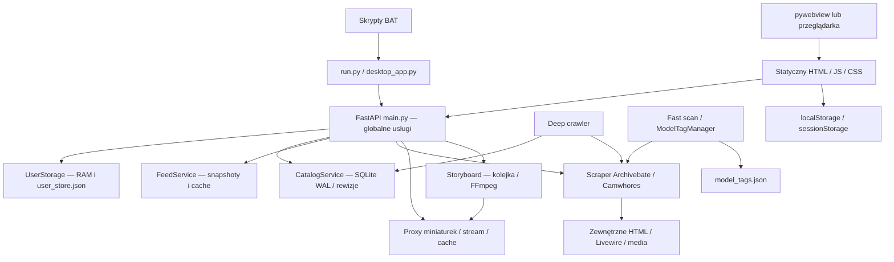
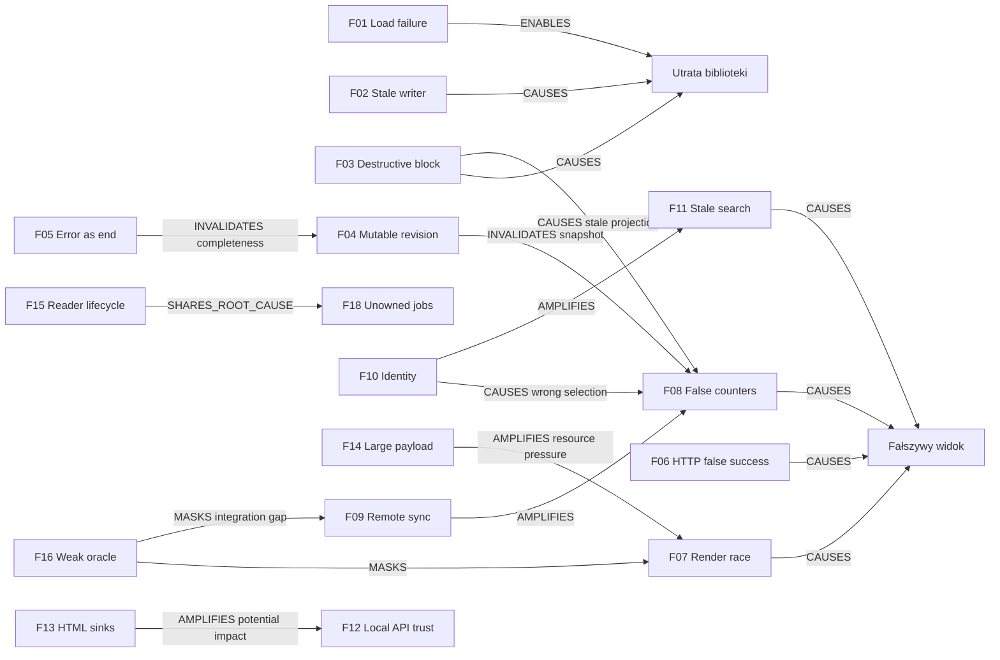

# ARCHIVEBITE_CZAT — Independent Next Generation Review

Data audytu: **12 września 2026**, Windows, lokalny checkout. Zakres: przegląd, projekt napraw i roadmapa; **bez implementacji napraw**. Raport nie jest certyfikatem bezpieczeństwa ani potwierdzeniem dostępności zewnętrznych dostawców.

[main]: C:/Projekty/Aplikacje/Archivebite_Czat/main.py
[storage]: C:/Projekty/Aplikacje/Archivebite_Czat/storage.py
[catalog]: C:/Projekty/Aplikacje/Archivebite_Czat/catalog_service.py
[deep]: C:/Projekty/Aplikacje/Archivebite_Czat/deep_archivebate.py
[scraper]: C:/Projekty/Aplikacje/Archivebite_Czat/scraper.py
[cw]: C:/Projekty/Aplikacje/Archivebite_Czat/camwhores.py
[cache]: C:/Projekty/Aplikacje/Archivebite_Czat/cache_store.py
[feed]: C:/Projekty/Aplikacje/Archivebite_Czat/feed_service.py
[story]: C:/Projekty/Aplikacje/Archivebite_Czat/storyboard_service.py
[tags]: C:/Projekty/Aplikacje/Archivebite_Czat/model_tags.py
[client]: C:/Projekty/Aplikacje/Archivebite_Czat/client.py
[config]: C:/Projekty/Aplikacje/Archivebite_Czat/config.py
[run]: C:/Projekty/Aplikacje/Archivebite_Czat/run.py
[desktop]: C:/Projekty/Aplikacje/Archivebite_Czat/desktop_app.py
[scan]: C:/Projekty/Aplikacje/Archivebite_Czat/fast_scan.py
[app]: C:/Projekty/Aplikacje/Archivebite_Czat/static/app.js
[views]: C:/Projekty/Aplikacje/Archivebite_Czat/static/video-views.js
[grid]: C:/Projekty/Aplikacje/Archivebite_Czat/static/video-grid.js
[card]: C:/Projekty/Aplikacje/Archivebite_Czat/static/video-card.js
[modal]: C:/Projekty/Aplikacje/Archivebite_Czat/static/video-modal.js
[account]: C:/Projekty/Aplikacje/Archivebite_Czat/static/account.js
[favorites]: C:/Projekty/Aplikacje/Archivebite_Czat/static/favorites.js
[blocked]: C:/Projekty/Aplikacje/Archivebite_Czat/static/blocked-models.js
[stats]: C:/Projekty/Aplikacje/Archivebite_Czat/static/home-stats.js
[filters]: C:/Projekty/Aplikacje/Archivebite_Czat/static/filters.js
[search]: C:/Projekty/Aplikacje/Archivebite_Czat/static/search-results.js
[checkpoint]: C:/Projekty/Aplikacje/Archivebite_Czat/static/checkpoints.js
[html]: C:/Projekty/Aplikacje/Archivebite_Czat/static/index.html
[api]: C:/Projekty/Aplikacje/Archivebite_Czat/static/api-client.js
[watch]: C:/Projekty/Aplikacje/Archivebite_Czat/static/watch.html
[ci]: C:/Projekty/Aplikacje/Archivebite_Czat/.github/workflows/ci.yml
[requirements]: C:/Projekty/Aplikacje/Archivebite_Czat/requirements.txt
[e-probes]: C:/Users/Skarabeusz/AppData/Local/Temp/archivebite-review-20260912-022310/probe-results.json
[e-more]: C:/Users/Skarabeusz/AppData/Local/Temp/archivebite-review-20260912-022310/more-results.json
[e-front]: C:/Users/Skarabeusz/AppData/Local/Temp/archivebite-review-20260912-022310/frontend-probe-results.json
[e-resource]: C:/Users/Skarabeusz/AppData/Local/Temp/archivebite-review-20260912-022310/resource-results.json
[e-tests]: C:/Users/Skarabeusz/AppData/Local/Temp/archivebite-review-20260912-022310/test-results.json
[e-retry]: C:/Users/Skarabeusz/AppData/Local/Temp/archivebite-review-20260912-022310/retry-results.json
[e-extra]: C:/Users/Skarabeusz/AppData/Local/Temp/archivebite-review-20260912-022310/additional-results.json

## 1. Executive Summary

**Aplikacja ma użyteczny, działający rdzeń lokalnego przeglądania, ale obecnie nie daje wystarczających gwarancji ochrony biblioteki, prawdziwości liczników ani stabilności wyników.** Najpierw należy naprawić stan i kontrakty sukcesu; rozszerzanie liczby funkcji powinno poczekać na ten etap.

Potwierdzono nadpisanie uszkodzonego magazynu pustym stanem przy kolejnej operacji, utratę zapisu przy dwóch właścicielach stanu oraz trwałe usuwanie ulubionych i historii podczas blokowania autora. To konkretne scenariusze odtworzone na danych syntetycznych, a nie diagnoza przyczyny wcześniejszych strat użytkownika. Istniejący plik kopii sprzed przywracania blokad nie dowodzi sam w sobie przebiegu wcześniejszego incydentu.

W przeglądarce z prawdziwym frontendem i izolowanym backendem strona oznaczona jako 280 filmów miała **448 kart, w tym 168 duplikatów**. Niezależna próba rzeczywistego renderera odtworzyła ten sam rodzaj wyścigu. Opublikowana rewizja katalogu może zmieniać zawartość podczas paginacji. Deep crawler może uznać timeout za koniec danych. Interfejs potrafi potwierdzić sukces po HTTP 503, a adapter synchronizacji zdalnej potrafi zwrócić sukces po nieudanej operacji Livewire.

Podejrzenie dotyczące liczników znalazło potwierdzenie: w zamrożonej kopii aktywna rewizja zawierała 85 771 rekordów, blokady ukrywały w niej 16 871, a osobny utrwalony licznik deklarował 115 782. Są to różne definicje i zakresy; UI nie wyjaśnia ich dostatecznie. Nie należy odejmować ostatniej wartości od aktywnego katalogu. Podejrzenie dotyczące różnych ścieżek uruchomienia pozostaje **częściowo niewyjaśnione**: skrypty w tym checkout wskazują ten sam katalog danych, ale faktycznie używanego innego procesu/instalatora nie zidentyfikowano.

Uruchomiono 38 różnych poleceń weryfikacyjnych: **35 zakończyło się kodem 0, trzy kodem 1**. Wszystkie 29 poleceń z obecnego CI ostatecznie zakończyło się kodem 0; nie jest to dowód pełnej poprawności. Kontrola negatywna wyłączyła produkcyjne `reconcilePage`, a regresja frontendowa nadal przeszła. Dwie dodatkowe regresje mają nieaktualne oczekiwania; testy wykazały także realny problem zwalniania czytników SQLite na Windows.

Rekomendacja: naprawa przyczyn etapami, bez przepisywania całej aplikacji. Najwyższa wartość: ochrona danych, odwracalne blokady, stabilne rewizje i jawne stany błędu, następnie spójne liczniki/tożsamość oraz rzeczywiste testy przeglądarkowe. Najmocniej uzasadniona optymalizacja to pobieranie członków grup na żądanie: jedna zmierzona strona grup serializowała 22 172 793 bajty JSON.

## 2. Review Scope, Method & Limitations

Źródłem prawdy były lokalne pliki, odczytane kontrakty i miejsca wywołań, Git, testy oraz niezależne próby. README i wcześniejsze raporty traktowano jako deklaracje. Nie wykonywano audytu GitHub ani szerokiego wyszukiwania internetowego. Nie instalowano zależności. Nie sprawdzano zewnętrznej bazy CVE, kont dostawców ani licencji całego drzewa zależności.

**Izolacja:** do katalogu tymczasowego skopiowano śledzone pliki checkout wraz z zastaną lokalną wersją `model_tags.json`. Nie kopiowano poświadczeń. Kopię katalogu SQLite wraz z WAL/SHM i kopię `user_store.json` odczytywano wyłącznie w osobnym `evidence-data`; oryginalnej bazy nie otwierano przez SQLite. `quick_check` skopiowanej bazy zwrócił `ok`. Kopia plików działającej bazy nie jest równoważna transakcyjnemu backupowi online; wynik dotyczy czytelnego, utrwalonego zestawu z momentu kopiowania.

Testy i probe używały syntetycznych magazynów JSON/baz. Runner usuwał zmienne `ARCHIVEBATE_*`, używał osłony sieci blokującej połączenia zewnętrzne i osobnych logów. Browser E2E działało na `127.0.0.1:8765`, z produkcyjnym frontendem i `main.app`, lecz z wyłączonym bootstrapem sieciowym i podmienionymi granicami dostawcy: 600 sztucznych filmów/20 autorów, lokalny 8-sekundowy MP4, sztuczna miniatura i niedostępny storyboard. Operacje biblioteki, filtrowanie, renderowanie i utrwalanie były rzeczywiste. Odtwarzanie tej próbki nie dowodzi sprawności resolvera zewnętrznego wideo.

Stosowane poziomy: **REPRODUCED** — odtworzone zachowanie; **CODE_CONFIRMED** — pełny istotny przepływ w kodzie; **INFERRED** — uzasadniony wniosek wymagający sprawdzenia; **BLOCKED** — przeszkoda środowiska. Status funkcji ma osobny, wąski zakres: PASS/PARTIAL/FAIL/UNTESTED/BLOCKED/NOT_APPLICABLE/INSUFFICIENT_EVIDENCE. PASS nie oznacza całej funkcji wraz z dostawcą, jeśli wprost wskazano fixture.

Ograniczenia: natywny WebView/okno desktop nie zostały uruchomione; narzędzie natywnego UI jest niedostępne. Odczyt `Win32_Process` był blokowany, więc nie ustalono pełnej listy poleceń istniejących procesów użytkownika. Nie wykonano prawdziwego wyłączenia zasilania, zapełnienia dysku, wielogodzinnego soak testu, testu złośliwej witryny w rzeczywistej przeglądarce ani pomiarów całego użycia RAM procesu/przeglądarki. Nie publikowano żadnych danych. Pomiary nie są benchmarkiem sprzętowym ani percentylami ruchu produkcyjnego.

Materiały dowodowe: [próby backendu i metadane][e-probes], [dodatkowe kontrakty][e-more], [próby JS][e-front], [zasoby i zapis JSON][e-resource], [pierwszy przebieg][e-tests], [powtórzenie błędów środowiska][e-retry], [regresje poza CI][e-extra]. Skrypty o analogicznych nazwach leżą obok wyników. Katalog tymczasowy zawiera prywatne kopie danych i nie jest pakietem do publicznego udostępniania.

## 3. Exact Local Source / Git State

| Właściwość | Stan objęty audytem |
|---|---|
| Checkout | `C:\Projekty\Aplikacje\Archivebite_Czat` |
| Branch | `master` |
| HEAD | `637acd42b5c4f6d244e37d3c0aff3002355c8098` |
| Tree | `57e6c667a2db1b1d2af8b0e18306a46b057b9e2b` |
| Origin | `https://github.com/eagleblastmusic-lgtm/Archve_czat.git` |
| Zastana zmiana śledzona | ` M data/model_tags.json` — uwzględniona w audycie, pozostawiona |
| Zastany plik nieśledzony | `data/user_store.json.before_block_restore_20260911_024720.bak` — pozostawiony |
| Reguły | Nie znaleziono lokalnych/rodzicielskich/nested `AGENTS.md`; zastosowano reguły przekazane przez użytkownika |
| Runtimes | `C:\Python314\python.exe` 3.14.4; `C:\Program Files\nodejs\node.exe` 24.19.0 |
| Środowisko projektu | Brak znalezionego `.venv`; użyto wykrytego Pythona systemowego |

Zapisano SHA256 i rozmiary wszystkich śledzonych plików oraz rzeczywistego magazynu, zastanej kopii i lokalnego pliku konfiguracji w `baseline.json`. Plik użytkownika miał 829 736 B; kopia 641 516 B; `model_tags.json` 286 220 B. Baza katalogu miała 706 052 096 B, WAL 8 610 832 B, SHM 32 768 B. To rozmiary plików przy inwentaryzacji, nie oszacowanie logicznego rozmiaru danych.

Końcowy wynik kontroli niezmienności i spis artefaktów znajduje się w sekcji 44. Żaden wynik wcześniejszego audytu nie został przyjęty jako aktualny PASS bez ponownej weryfikacji właściwych wejść.

## 4. Actual Application Architecture

[main.py][main] scala routing, projekcje stanu, konto, media i lifecycle. Obiekty sesji, scraperów i magazynów są globalne; część skutków ubocznych następuje przy imporcie. [storage.py][storage] jest magazynem użytkownika, [catalog_service.py][catalog] magazynem metadanych i rewizji, [deep_archivebate.py][deep] drugim piszącym komponentem w tej samej bazie. [feed_service.py][feed] utrzymuje osobną ścieżkę progresywnych snapshotów/fallbacku. Jest to kilka silników odczytu o częściowo wspólnych regułach, nie jeden model zapytania.

Frontend jest modułowym vanilla JS bez wykrytego bundlera i lockfile Node. [app.js][app] nadal zawiera kompatybilnościowe implementacje, podczas gdy aktywne moduły [video-grid.js][grid], [video-views.js][views], [account.js][account] i inne wykonują główne operacje. Wspólny [api-client.js][api] istnieje, lecz nie wszystkie mutacje go używają. CSS i fonty obejmują zewnętrzne zasoby; nie ma oddzielnego skompilowanego builda desktop.

„Archiwum” oznacza przede wszystkim lokalny indeks metadanych i odwołania do zewnętrznych mediów. Nie znaleziono trwałej zarządzanej biblioteki pobranych filmów ani gwarancji odtwarzania offline. Nazwy modułów `youtube-storyboard` opisują interakcję osi czasu; nie stanowią dowodu integracji API YouTube.

## 5. Actual Runtime / Launch Modes

[run.py][run] sprawdza zajętość portu, uruchamia Uvicorn na `127.0.0.1:8000` bez reload i otwiera przeglądarkę po stałym opóźnieniu. Próba zajętego portu odrzuciła start i pozostawiła istniejący listener. [desktop_app.py][desktop] uruchamia backend w wątku daemon, czeka na HTTP i otwiera pywebview 1440×920, minimum 960×640. Brak pełnego zarządzania zamykaniem Uvicorna i wszystkich usług przy zamknięciu okna.

`start.bat` i `URUCHOM_PROGRAM.bat` przechodzą do katalogu skryptu, uruchamiają `pip install -r requirements.txt` i `python run.py`; `Uruchom_Desktop.bat` wybiera wrapper desktop. Bezpośrednie `python main.py` włącza reload. `uvicorn main:app` zależy od sposobu znalezienia modułu i przekazanych opcji. Nie znaleziono artefaktu EXE, specyfikacji PyInstaller ani procesu budowania instalatora.

Lifespan uruchamia inicjalizację konta, katalogu i automatyczne zadania w tle; nie należy używać importu całego `main` jako neutralnej biblioteki. Normalny brak poświadczeń jest obsługiwany jako tryb lokalny. Testy nie uruchamiały logowania na konto użytkownika. Szczegółowa macierz ścieżek jest w sekcji 14.

## 6. Actual Data & State Flow

| Operacja | Rzeczywisty przepływ i granica autorytetu |
|---|---|
| Strona katalogu | filtry JS → API → wybór rewizji → SQL source/author/block/favorite → liczniki i strona → wzbogacenie metadanych/flag → renderer; kilka SELECT bez jednej transakcji odczytu |
| Ulubiony film | payload karty → toggle API → lokalny zapis JSON → opcjonalny remote toggle → JSON → aktualizacja karty/liczników; wynik zdalny nie jest autorytetem lokalnego zapisu |
| Historia | otwarcie/odtwarzanie → record API → JSON; to zdarzenie wizyty, nie dowód obejrzenia całości; lokalna historia ograniczana do 1000, merge zdalny ma inne zachowanie |
| Blokada | nazwa autora → normalizacja → estymacja liczby filmów → blokada + usunięcie wpisów konta → JSON → unieważnienie części cache → usunięcie kart; unblock nie przywraca danych |
| Synchronizacja konta | sesja → zdalne kolekcje w ograniczonej liczbie stron → additive merge → JSON → projekcje; brak pełnego modelu konfliktów/usunięć/outbox |
| Search/model | q/nazwa + filtry → scrape/cache → wzbogacenie → grupowanie/paginacja → UI; to nie pełnotekstowe wyszukiwanie całej bazy SQLite |
| Indeksowanie | parser źródła → normalizacja ID/dat → import transakcyjny → checkpointy/revision publish; deep równolegle dopisuje do opublikowanej rewizji |
| Wideo | ID/URL → details/resolver → walidacja URL/redirect → proxy Range → player; historia i lease storyboard mają osobne ścieżki |
| Storyboard | demand/lease → kolejka → FFmpeg → obrazy/metadane czasu → cache dyskowy → timeline; segmenty i szybka/pełna wersja mają odrębny stan |
| Wznowienie | checkpoint w localStorage → tryb/query/page → ponowna nawigacja; nie utrwala pełnego kontekstu filtra/modelu/rewizji |

Dominujące autorytety: JSON dla intencji biblioteki, SQLite dla zaindeksowanych metadanych, dostawca dla dostępności mediów, localStorage dla preferencji widoku. Liczniki mieszają te autorytety; RAM procesu, RAM frontend i zdalna biblioteka mogą każdy przedstawiać inną wersję semantycznie podobnego stanu.

## 7. Feature Inventory

Każdy wiersz zawiera cel, wejście/implementację, stan i zależności, oczekiwanie oraz dowód/status/ograniczenie. Oznaczenia pokrycia: **CI** — odpowiednie polecenia w sekcji 21; **probe** — niezależne skrypty; **UI** — przeglądarka z izolowanym dostawcą; **kod** — tylko inspekcja. Pokrycie CI nie oznacza pełnego E2E.

| ID / funkcja i cel | Wejście / implementacja | Stan / zależności | Oczekiwanie | Pokrycie, runtime i granice |
|---|---|---|---|---|
| C01 Start browser | BAT → [run][run] → `/` | katalog projektu, Python/Uvicorn/przeglądarka | jeden backend, poprawna ścieżka | probe port + UI start PASS; BAT/pip pełne UNTESTED |
| C02 Okno desktop | BAT → [desktop][desktop] | ten sam backend, WebView2/pywebview, własny profil przeglądarki | ten sam stan serwera | kod; native BLOCKED |
| C03 Konfiguracja konta | USTAW_KONTO.bat, [config][config] | env/.env.local/credentials.local.json | jawne pierwszeństwo i poprawne wartości | probe quoted value FAIL; brak konta PARTIAL |
| C04 Ładowanie/zapis biblioteki | [storage][storage] | JSON + RAM, filesystem | zachowanie danych i atomowość | CI rollback, probe restart PASS; korupcja/multiowner FAIL |
| C05 Katalog główny | `/api/videos`, `/api/feed`; [views][views], [catalog][catalog] | SQLite, preferencje, cache | wyniki i liczby tej samej rewizji | CI + UI PARTIAL; F04/F07 |
| C06 Feed progresywny/SSE | `/api/feed/stream`; [feed][feed] | snapshoty RAM/raw cache/executory | progres bez fałszywego końca i stale responses | CI fixtures PASS w zakresie; live UNTESTED |
| C07 Źródło all/AB/CW | [filters][filters] → API | localStorage, provider ID | ten sam predicate strony i count | CI/probe/UI PARTIAL; F10 |
| C08 Filtr autorów ulubionych/wykluczenie | [filters][filters], [catalog][catalog] | favorites/following/blocked | spójna kwalifikacja autora/filmu | CI + probe + UI; FAIL dla ID/cache/count |
| C09 Grupowanie autorów | [grid][grid], SQL grouped | członkowie grup w odpowiedzi | jeden kafel/autora, dostęp do filmów | UI 20 grup/600 filmów PASS; skala PARTIAL |
| C10 Sortowanie | [catalog][catalog], scraper, [views][views] | daty/ID/group key | deterministyczny porządek w danym trybie | CI fixtures PARTIAL; brak uniwersalnego menu sortowania |
| C11 Paginacja/lazy render/cache strony | [views][views], pagination.js, [grid][grid] | revision/page/generation RAM | brak powtórzeń/przeskoków | UI+probe FAIL; F04/F07 |
| C12 Odświeżanie/nawigacja | [views][views], app-events.js | request token/AbortController/cache | najnowsza wybrana strona | CI PARTIAL; równa długość nie dowodzi równej treści |
| C13 Search filmów/profili | `/api/search`, `/api/search/stream`; [scraper][scraper], [search][search] | RAM/dysk provider cache, q/filtry | właściwe wyniki albo jawny błąd | CI fixtures; probe stale FAIL; live UNTESTED |
| C14 Autocomplete/tagi | search-autocomplete.js, tags.js, `/api/tags` | model_tags/cache | wybór sugestii i filtra | kod+CI częściowo; runtime PARTIAL |
| C15 Strona modelu | `/api/model/{username}`; [views][views] | provider/cache, model query | filmy konkretnego modelu | CI parserów PARTIAL; live UNTESTED |
| C16 Ulubione toggle/lista | konto/karta → account routes; [favorites][favorites] | JSON, opcjonalnie remote | trwały stan i uczciwy wynik | UI zapis/restart PASS; 503/remote/ID FAIL |
| C17 Historia record/list/clear | player/panel → [account][account], [storage][storage] | JSON + remote merge | wpis wizyty, kontrolowane clear | UI record/restart PASS; clear 503 FAIL |
| C18 Obserwowani | `/api/account/following`, panel | JSON synchronizowany, provider | lista lokalnie posiadanych wpisów | CI/probe projekcji PARTIAL; pełne live UNTESTED |
| C19 Konto/status/relogin/sync | panel, `/api/status`, `/api/relogin`, `/api/account/sync` | sesja, credentials, last_synced | rozróżnia lokalne/login/sync/error | probe remote + UI label FAIL |
| C20 Blokowanie i zarządzanie | karta, `/block`, `/unblock`, `/api/blocked_models` | JSON, estymacje, cache | ukrycie i spójne przywrócenie | UI/probe FAIL utrata + stale badges |
| C21 Liczniki/statystyki | `/api/stats`, account summary, nagłówki | różne scope RAM/JSON/SQL | etykiety zgodne z wartością | real copy+UI+probe FAIL |
| C22 Checkpoint/wznowienie | akcja karty, [checkpoint][checkpoint] | localStorage | powrót do kontekstu filmu | kod PARTIAL; pełny kontekst nieutrwalony |
| C23 Detale/karta/miniatury | `/api/video/details`, `/api/thumb`; [card][card], [main][main] | provider, cache RAM/dysk | bezpieczne dane i fallback | CI+UI fixture PARTIAL; F13 |
| C24 Player modal/sterowanie | [modal][modal], player-core.js, modal-player-controls.js | media URL, RAM, backend history | play/pause/seek/volume/fullscreen | UI film 8 s PASS; błędy live UNTESTED |
| C25 Popout/watch/download link | `/watch/{id}`, [watch][watch], akcje player | sessionStorage/local state/provider URL | osobne odtwarzanie/przekazanie ID | CI/kod PARTIAL; pełne popout/download UNTESTED |
| C26 Proxy stream/odświeżenie URL | `/api/video/stream`, playback/status | requests, Range, resolver/cache | poprawne zakresy i bezpieczne przekierowania | CI fixture PARTIAL; real provider UNTESTED |
| C27 Storyboard quick/full/segment | storyboard routes, [story][story], youtube-storyboard.js | FFmpeg, cache, lease | właściwy czas klatki, gotowość/oczekiwanie | CI FFmpeg i PTS PASS fixture; UI live UNTESTED |
| C28 Koordynacja storyboard kart | demand DELETE/POST, storyboard-cache.js | localStorage/BroadcastChannel, TTL | ograniczenie pracy i watchers | CI PASS w harness; endurance UNTESTED |
| C29 Prefetch/cache media | video-prefetch.js, performance.js, [main][main] | bounded RAM/disk, timery | lepsza responsywność i cleanup | CI/kod PARTIAL; duża sesja UNTESTED |
| C30 Fast scan modeli | `/api/scan/start/status`, profile-scanner.js, [scan][scan] | model_tags, daemon/pule/provider | obserwowalny, pojedynczy skan | kod; status nie opisuje joba, PARTIAL |
| C31 Deep discovery/crawl | `/api/deep-archivebate/*`; [deep][deep] | SQLite queue/models/items | wznawianie, retry, prawdziwy koniec | CI + probe FAIL timeout/end/revision |
| C32 Import katalogu/migracje/resume | [catalog][catalog] bootstrap/indexer | SQLite schema/revisions/source_runs | atomowy zapis i monotonic publication | CI fixtures PASS; nie wszystkie realne legacy shapes |
| C33 Cache trwały/atomic files | [cache][cache], [tags][tags] | data cache dirs, JSON, fsync/replace | odzyskiwalny cache, bez niepełnych plików | CI/probe częściowo PASS; wyłączenie zasilania UNTESTED |
| C34 Klawiatura, dialogi, toasty | app-events.js, modal controls, toast.js | focus/DOM | pełna obsługa bez myszy | kod/UI PARTIAL; F19 |
| C35 Własne karty „+” | [index.html][html] appTabNewBtn | brak znalezionego managera | utworzenie karty zgodnie z tooltip | UI brak działania FAIL; F19 |
| C36 Backup/export/import stanu | brak wejścia UI/API | ręczne pliki, zastany backup | kontrolowana odzyskiwalność | NOT_APPLICABLE jako istniejąca funkcja; GAP U03 |
| C37 Obejrzane/offline archive | historia/link download | brak flagi ukończenia i rejestru pobrań | nie mylić wizyty z obejrzeniem/pobraniem | NOT_APPLICABLE jako pełna funkcja; ograniczenie produktu |
| C38 Narzędzia diagnostyczne dewelopera | audit/*, test_suite, bench/measure/debug/find scripts | zależne od importów/URL | bezpieczna, reprodukowalna diagnostyka | testy wybrane uruchomione; ad hoc live scripts nieuruchomione |

Inwentaryzacja AST wykazała **40 deklaracji metoda–ścieżka** w `main.py` (w tym GET/POST tej samej operacji storyboard i dwie strony HTML). To nie 40 niezależnych funkcji użytkownika. Dodatkowe zasoby statyczne i automatyczna dokumentacja FastAPI nie są osobno liczone.

## 8. Functional Verification Matrix

| Przepływ / warunek | Status | Faktycznie sprawdzony wynik |
|---|---|---|
| Start izolowanego backendu i otwarcie UI | PASS | produkcyjny HTML/JS + fixture 600; backend nie wykonywał bootstrapu zewnętrznego |
| Konflikt portu | PASS | start odrzucony; cudzy listener nie zamknięty |
| Lokalny favorite → panel → restart osobnego procesu | PASS | ten sam zapis nadal obecny; także block flag w osobnym probe |
| Player → koniec 8 s → historia → restart | PASS | lokalna próbka odtworzona, historia utrwalona |
| Group/only_fav | PARTIAL | 20 grup po 30, potem jedna grupa 30; nie dowodzi poprawności wszystkich identyfikatorów |
| Paginacja UI/cache/render | FAIL | 448 DOM/280 unique; deterministycznie 112/64 |
| Block → unblock | FAIL | biblioteka nie odzyskuje usuniętych pozycji; stare badges do wejścia w konto |
| Liczniki konta i katalogu | FAIL | count 1/lista 0; różne definicje blocked; nagłówek po usunięciu nieaktualny |
| Zapis po uszkodzeniu JSON | FAIL | kolejna mutacja nadpisuje uszkodzony plik; brak kopii |
| Dwa właściciele JSON | FAIL | sukces A, sukces B, dysk tylkoB |
| Błąd zapisującego backendu | PARTIAL | backend rollback/503 objęty testami; UI dla 503 deklaruje sukces |
| Empty/malformed/duplicates | PARTIAL | pusty katalog obsłużony fixture; brak ID zaakceptowany i scalony w `None`; tożsamość źródeł niespójna |
| Indeksowanie przy timeout | FAIL | deep zapisuje zakończenie bez last_error; shallow ma lepszy strict contract |
| Rewizja podczas równoległego zapisu | FAIL | token ten sam, stronowanie powtarza ID; licznik i wynik z różnych snapshotów |
| Search po zmianie ulubionego | FAIL | 0 przed, 0 po mutacji,1 po usunięciu cache |
| Synchronizacja realnego konta | UNTESTED | bez poświadczeń/sieci; wrapper failure odtworzony jako false success |
| Resolver/media dostawcy | UNTESTED | synthetic E2E nie obejmuje dostawcy ani zmian HTML/CDN |
| Desktop/WebView2 end-to-end | BLOCKED | brak dostępnego natywnego sterowania; źródła przeanalizowane |
| Ten sam faktyczny store we wszystkich użytkowanych instalacjach | INSUFFICIENT_EVIDENCE | jeden checkout mapuje poprawnie; nie zidentyfikowano drugiego launch path użytkownika |
| Duża baza / scaling | PARTIAL | kopia realna i 1k/10k/50k; pomiary poniżej, bez endurance |
| Crash/power loss/disk full fizycznie | UNTESTED | inspekcja fsync/replace i fault injection zapisów; nie crash laboratoryjny |
| Pełne „obejrzane” i biblioteka offline | NOT_APPLICABLE | takich kontraktów nie zaimplementowano |

## 9. What Is Already Good

Atomowy zapis JSON używa pliku tymczasowego w tym samym katalogu, `flush`, `fsync` i `os.replace`; mutacje magazynu mają rollback pamięci po błędzie zapisu. To istotna ochrona przed częściowym plikiem, choć nie chroni przed poprawnie zapisanym błędnym stanem. Testy pakietu D sprawdzają część tych błędów.

Katalog ma indeksy, transakcje importu, WAL i rozdzielenie czytnika od pisarza, dzięki czemu długi import nie musi blokować każdego odczytu. Testy migracji zakresu, wznowień, sparse pagination i monotonicznego publikowania zawierają wartościowe scenariusze. Grupowanie pobiera członków partią, co usuwa N+1; pozostałym problemem jest wielkość partii.

Domyślne bindowanie do loopback, bezpieczna odmowa zajętego portu, walidacja URL i kolejnych redirectów, argumenty FFmpeg przekazywane jako lista bez shell oraz haszowane klucze cache ograniczają istotne klasy ryzyka. Nie znaleziono podstaw do twierdzenia o działającym zdalnym RCE lub dowolnym odczycie plików.

Frontend zawiera generacje żądań/anulowanie, moduły projekcji, cache stron, obsługę Escape i osobne kontrakty storyboard lease. Testy FFmpeg korzystają z rzeczywistych próbek oraz sprawdzają mapowanie czasu, a nie tylko istnienie obrazu. Te elementy warto zachować i doprowadzić do spójnego działania, zamiast zastępować frameworkiem.

## 10. Defects Found

Priorytet oznacza kolejność napraw: P0 — dane/prawdziwość stanu/fundamentalny przepływ; P1 — istotna niezawodność, kontrakty i wydajność; P2 — ergonomia i dalsze porządkowanie. Severity opisuje skutek w podanym scenariuszu, a nie częstość; częstość rzeczywistych incydentów jest nieznana. Każde ustalenie poniżej ma plan lub strategię i wskazuje zakres dowodu.

### F01 — Uszkodzony magazyn zostaje zastąpiony nowym stanem

**TYPE:** RELIABILITY. **SEVERITY:** CRITICAL. **CONFIDENCE:** HIGH. **EVIDENCE TYPE:** REPRODUCED. **PRIORITY:** P0. **ESTIMATED COMPLEXITY:** M.

**AFFECTED COMPONENTS:** [storage.py][storage] `load` od linii 63, `save`, `_atomic_update`; [main][main]. **CURRENT BEHAVIOR / OBSERVATION:** błąd odczytu/parsing JSON jest logowany; obiekt pozostaje z domyślnymi pustymi kolekcjami. **EXPECTED / SAFE BEHAVIOR:** odróżnić brak pierwszego pliku od uszkodzenia istniejącego i zablokować destrukcyjne zapisy do czasu odzyskania.

**ROOT CAUSE:** brak stanu `load_failed` i kontraktu poprawności magazynu przed mutacją. **USER IMPACT:** utrata pozostałej odzyskiwalnej zawartości, gdy użytkownik wykona zwykłą akcję. **TECHNICAL IMPACT:** atomowy zapis utrwala logicznie błędny pusty stan; atomicity nie zapobiega temu scenariuszowi.

**REPRODUCTION:** w izolowanym JSON zapisać urwany `{"favorites":[`, utworzyć `UserStorage`, dodać film `new`. **EVIDENCE:** [corrupt_overwrite][e-probes] — poprawny nowy JSON, ID `new`, zero kopii. **HYPOTHESIS LIMIT:** nie dowodzi, że taki incydent już wystąpił na realnym pliku.

**FIX STRATEGY:** fail closed dla uszkodzonego źródła i jawne odzyskanie. **SUGGESTED IMPLEMENTATION:** stan load/health, walidacja schematu, nienadpisywana kwarantanna i kopia ostatniej poprawnej wersji; patrz B01. **REGRESSION TEST:** uszkodzony/nieczytelny/źle typowany plik → każda mutacja odrzucona, hash oryginału równy, komunikat w UI. **DEPENDENCIES:** brak; wspólna baza dla F02/F03. **RISK OF FIX:** przypadkowe uznanie nowej instalacji za uszkodzenie; test brak pliku osobno.

### F02 — Dwa właściciele magazynu tracą poprawnie potwierdzone zapisy

**TYPE:** RELIABILITY. **SEVERITY:** HIGH. **CONFIDENCE:** HIGH. **EVIDENCE TYPE:** REPRODUCED. **PRIORITY:** P0. **ESTIMATED COMPLEXITY:** M.

**AFFECTED COMPONENTS:** [storage][storage] konstruktor, `save`, blokady; [run][run]/[desktop][desktop]. **CURRENT BEHAVIOR:** każda instancja trzyma własny snapshot; druga nadpisuje cały plik. **EXPECTED / SAFE BEHAVIOR:** jeden właściciel zapisu albo transakcja wykrywająca konflikt. **ROOT CAUSE:** RLock i atomowy replace są lokalne dla procesu/pamięci, bez kontroli wersji na dysku.

**USER IMPACT:** dodany ulubiony/blokada znika mimo wcześniejszego sukcesu. **TECHNICAL IMPACT:** lost update bez uszkodzenia JSON. **REPRODUCTION:** dwie instancje wczytują pusty plik; pierwsza dodaje A, druga B; restart pokazuje tylko B. **EVIDENCE:** [stale_writer][e-probes]. Odtworzono dwóch niezależnych właścicieli w jednym procesie; nie prowadzono równoległego testu dwóch realnych aplikacji. Domyślne launchery chronią wspólny port 8000, ale nie własność store przy innym porcie, workerach lub narzędziach.

**FIX STRATEGY:** procesowa blokada właściciela konkretnej ścieżki magazynu, ewentualnie później transakcje SQLite. **SUGGESTED IMPLEMENTATION:** normalizowana ścieżka, lock OS utrzymywany przez właściciela, odmowa drugiego pisarza; B02. **REGRESSION TEST:** dwa osobne procesy i dwa porty, brak utraty A; po awarii lock zwalnia OS. **DEPENDENCIES:** F01. **RISK OF FIX:** martwa blokada plikowa i błędna normalizacja ścieżek; nie stosować samego pliku „lock exists”.

### F03 — Blokada autora nieodwracalnie usuwa bibliotekę

**TYPE:** DEFECT. **SEVERITY:** HIGH. **CONFIDENCE:** HIGH. **EVIDENCE TYPE:** REPRODUCED. **PRIORITY:** P0. **ESTIMATED COMPLEXITY:** M.

**AFFECTED COMPONENTS:** [storage][storage] `block_model`237–296, [main][main]2061, [blocked][blocked]. **CURRENT BEHAVIOR:** block usuwa pasujące favorites/history/following; unblock usuwa tylko blokadę/licznik. **EXPECTED / SAFE BEHAVIOR:** ukrycie bez utraty intencji biblioteki albo osobna, jawna operacja trwałego usunięcia. **ROOT CAUSE:** wykluczanie z widoku połączone z fizycznym kasowaniem kolekcji.

**USER IMPACT:** odblokowany autor nie odzyskuje zapisanych filmów/historii. **TECHNICAL IMPACT:** brak dziennika/tombstone pozwalającego odtworzyć poprzedni stan. **REPRODUCTION:** favorite+history dla Fixture → block → unblock; obie listy długości 0. **EVIDENCE:** [block_unblock_loss][e-probes] i UI zniknięcie biblioteki po block; etykieta karty opisuje blokowanie/ukrywanie, nie trwałe usunięcie danych.

**FIX STRATEGY:** blokada jako niezależny predicate projekcji. **SUGGESTED IMPLEMENTATION:** zachować kolekcje, przenosić ewentualne historyczne usunięcia tylko poprzez kontrolowane scalanie kopii z podglądem; B03. **REGRESSION TEST:** favorite/history/following identyczne przed block i po unblock, restart pomiędzy, sync w trakcie. **DEPENDENCIES:** F01/F02, liczniki F08. **RISK OF FIX:** automatyczne przywrócenie starych usunięć użytkownika z backupu; migracja nie może odgadywać intencji.

### F04 — Rewizja nie gwarantuje stałej zawartości ani spójnego odczytu

**TYPE:** ARCHITECTURE. **SEVERITY:** HIGH. **CONFIDENCE:** HIGH. **EVIDENCE TYPE:** REPRODUCED. **PRIORITY:** P0. **ESTIMATED COMPLEXITY:** L.

**AFFECTED COMPONENTS:** [deep][deep] `_store_videos_locked`366–410 i wybór rewizji; [catalog][catalog] `query_page`559–818, [views][views]. **CURRENT BEHAVIOR:** deep dopisuje do ostatniej complete i ostatniej nonfailed rewizji. Count/page/revision wykonują osobne SELECT w autocommit. **EXPECTED / SAFE BEHAVIOR:** opublikowana rewizja niemutowalna, cały response z jednego snapshotu.

**ROOT CAUSE:** numer rewizji używany jednocześnie jako snapshot i modyfikowany zbiór roboczy; brak jawnej transakcji odczytu. **USER IMPACT:** powtórzenia i pominięcia przy stronowaniu, mylące wyniki odświeżania. **TECHNICAL IMPACT:** cache pod tym samym kluczem reprezentuje różną treść; count może nie pasować do items.

**REPRODUCTION:** rev 1 `[1,2,3]`, page 1size 2 `[1,2]`; deep dodaje nowszy film; page 2 `[2,3]`, rev 1 nadal complete, liczba 3→4. Osobny kontrolowany insert między count a SELECT danych daje count 1/items 2. **EVIDENCE:** [published_revision_moves][e-probes], [count_page_read_skew][e-more]. **FIX STRATEGY:** publikacja snapshotu i transakcja odczytu. **SUGGESTED IMPLEMENTATION:** jeden writer kontraktu rewizji, deep tylko staging, batch publish nowej wersji; B04. **REGRESSION TEST:** overlap deep/import/page, zawartość i hash opublikowanej rewizji stałe. **DEPENDENCIES:** semantyka F05; F16 real oracle. **RISK OF FIX:** koszt kopii rewizji i migracja obecnego katalogu; etapować.

### F05 — Błędy sieci deep crawlera stają się trwałym „końcem danych”

**TYPE:** RELIABILITY. **SEVERITY:** HIGH. **CONFIDENCE:** HIGH. **EVIDENCE TYPE:** REPRODUCED. **PRIORITY:** P0. **ESTIMATED COMPLEXITY:** M.

**AFFECTED COMPONENTS:** [scraper][scraper]604–700, [deep][deep]271,342,414–481. **CURRENT BEHAVIOR:** parser łapie wyjątek i zwraca pustą listę; crawler po trzech pustych stronach kończy profil, discovery oznacza done. **EXPECTED / SAFE BEHAVIOR:** timeout/parse failure pozostawia retryable job i kursor; tylko zweryfikowany koniec daje complete. **ROOT CAUSE:** lista reprezentuje zarówno poprawne zero danych, jak błąd transportu/parsera.

**USER IMPACT:** niepełne archiwum wygląda na ukończone i może nie być ponownie skanowane. **TECHNICAL IMPACT:** utrwalone błędne checkpointy bez `last_error`. **REPRODUCTION:** wymusić Timeout w produkcyjnym session.get; trzy crawl_step: next_page 4, complete 1, `consecutive_empty_pages:3:3`, errornull; discovery done po pierwszej próbie. **EVIDENCE:** [deep_network_error_as_end][e-probes].

**FIX STRATEGY:** typowany wynik fetch z rozróżnieniem items/confirmed_empty/end/retryable/fatal. **SUGGESTED IMPLEMENTATION:** propagacja od parsera do checkpoint transaction, retry z opóźnieniem, rekwalifikacja podejrzanych historycznych terminali; B05. **REGRESSION TEST:** prawdziwy parser+timeout/invalidHTML/emptySuccess; żadnego complete po błędzie. **DEPENDENCIES:** F04, test oracle F16. **RISK OF FIX:** masowy recrawl i obciążenie dostawcy; kolejkować stopniowo.

### F06 — Frontend potwierdza mutację po HTTP 503

**TYPE:** DEFECT. **SEVERITY:** HIGH. **CONFIDENCE:** HIGH. **EVIDENCE TYPE:** REPRODUCED. **PRIORITY:** P0. **ESTIMATED COMPLEXITY:** S/M.

**AFFECTED COMPONENTS:** [account][account] `clearHistory`167, [favorites][favorites] toggle, [api][api]. **CURRENT BEHAVIOR:** `fetch`503 jest parsowane jak sukces; historiaCount 0 i toast sukcesu, favorite flag/count `undefined`. **EXPECTED / SAFE BEHAVIOR:** stan zostaje przy poprzedniej wartości i widoczny błąd; sukces dopiero po poprawnym kontrakcie backendu. **ROOT CAUSE:** pomijanie `response.ok` oraz struktury odpowiedzi, mimo istniejącego wspólnego adaptera.

**USER IMPACT:** użytkownik uważa dane za usunięte/zapisane, choć backend odrzucił operację. **TECHNICAL IMPACT:** frontend rozjeżdża się z trwałym store. **REPRODUCTION:** rzeczywiste moduły JS, fetch zwraca 503 `{detail:'disk full'}`; obserwować toast i state. **EVIDENCE:** [clear_503/favorite_503][e-front]. Nie zapełniano realnego dysku; przetestowano kontrakt HTTP błędu.

**FIX STRATEGY:** wspólny adapter mutacji i jawny wynik local/remote. **SUGGESTED IMPLEMENTATION:** API error typing, walidacja payload, blokada lub serializacja powtórnej akcji, zachowanie/rollback widoku; B06. **REGRESSION TEST:** 503/401/nonJSON/timeout/out-of-order, backend i DOM zgodne po odświeżeniu. **DEPENDENCIES:** F16; F09 dla remote. **RISK OF FIX:** podwójny retry nieidempotentnego toggle; użyć desired state.

### F07 — Nakładanie renderu cache i odpowiedzi tworzy duplikaty kart

**TYPE:** DEFECT. **SEVERITY:** HIGH. **CONFIDENCE:** HIGH. **EVIDENCE TYPE:** REPRODUCED. **PRIORITY:** P0. **ESTIMATED COMPLEXITY:** M.

**AFFECTED COMPONENTS:** [grid][grid] `replaceView`141, `reconcilePage`221; [views][views] render cached/page reconciliation. **CURRENT BEHAVIOR:** replaceView planuje dalsze chunki; reconcile wcześniej wstawia pozostałe karty; chunki nie sprawdzają istniejącego ID i później je dublują. **EXPECTED / SAFE BEHAVIOR:** dokładnie jedna karta per scoped ID w danej generacji widoku. **ROOT CAUSE:** dwaj aktywni właściciele aktualizacji tego samego DOM, bez wspólnego lifecycle render task.

**USER IMPACT:** fałszywa liczba wyników, zbędne przewijanie, niestabilna nawigacja. **TECHNICAL IMPACT:** dodatkowy DOM/listenery/media requests. **REPRODUCTION:** rzeczywisty renderer: replace 64 → reconcile 64 przed timerami → drain;112 kart 64 unique. Browser strona 2fixture:448/280. **EVIDENCE:** [render_reconcile_interleaving][e-front] i obserwacja UI. Osobny code-confirmed skrót w [views][views] uznaje równą długość pełnej strony za brak zmiany, choć ID mogą się różnić.

**FIX STRATEGY:** jeden renderer z generacją i keyed upsert. **SUGGESTED IMPLEMENTATION:** reconcile unieważnia pending chunks, append sprawdza mapę ID, porównanie treści zamiast samej długości; B07. **REGRESSION TEST:** deterministyczny scheduler i prawdziwy browser DOM, equalLengthDifferentIDs. **DEPENDENCIES:** F10 identity; F16. **RISK OF FIX:** flash/utrata scroll/focus; zachować istniejące węzły.

### F08 — Liczniki nie mają wspólnego zakresu i aktualizacji

**TYPE:** DEFECT. **SEVERITY:** HIGH. **CONFIDENCE:** HIGH. **EVIDENCE TYPE:** REPRODUCED. **PRIORITY:** P0. **ESTIMATED COMPLEXITY:** M/L.

**AFFECTED COMPONENTS:** [main][main]570–691,892–934,2117–2151; [storage][storage]blocked counters; [stats][stats], [blocked][blocked], [html][html]. **CURRENT BEHAVIOR:** count/slice konta przed block/dedup enrichment; `blocked_videos` bywa base-minus-filtered także po filtrze favorites; estymaty i globalne stałe są prezentowane obok liczb aktywnego widoku. DOM liczony przed opóźnionym usunięciem; navbar odświeża się dopiero w panelu konta. Statyczna etykieta „Zalogowano do Archivebate” występuje również przy koncie nieskonfigurowanym.

**EXPECTED / SAFE BEHAVIOR:** każda liczba ma scope, predicate, rewizję i informację exact/estimated; lista i count są tą samą projekcją. **ROOT CAUSE:** osobno liczone, niezależnie cache'owane projekcje bez wersji preferencji. **USER IMPACT:** nie można wiarygodnie ocenić rozmiaru biblioteki ani efektu blokowania. **TECHNICAL IMPACT:** testowanie błędnych invariantów i invalidation ad hoc.

**REPRODUCTION:** sync przywraca zablokowaną pozycję → total 1/count 1/videos 0; block w UI →0 kart, nagłówek 1, badge 1. **EVIDENCE:** [more-results][e-more], realne agregaty [probe-results][e-probes]; szczegółowe definicje w sekcji 13. **FIX STRATEGY:** wspólny obiekt projection i jawne nazwy; **SUGGESTED IMPLEMENTATION:** filter→dedup→count→page, `catalogRevision/preferencesVersion/scope/accuracy`, publikacja jednej aktualizacji UI; B08. **REGRESSION TEST:** wszystkie kombinacje source/favorite/block/group, brak nieopisanych estymat. **DEPENDENCIES:** F03/F04/F10. **RISK OF FIX:** wartości spadną bez usunięcia danych; wyjaśnić zmianę definicji.

### F09 — Synchronizacja potwierdza nieudaną operację i nie rozwiązuje konfliktów

**TYPE:** DEFECT. **SEVERITY:** HIGH. **CONFIDENCE:** HIGH dla wrappera; MEDIUM dla skutków live. **EVIDENCE TYPE:** REPRODUCED + CODE_CONFIRMED. **PRIORITY:** P1. **ESTIMATED COMPLEXITY:** L.

**AFFECTED COMPONENTS:** [scraper][scraper] `toggle_remote_save`1368, synchronizacja konta; [main][main]607/693/relogin; [storage][storage]merge; [account][account]. **CURRENT BEHAVIOR:** wrapper zwraca True po wywołaniu Livewire niezależnie od jego None/błędu; lokalny toggle wyprzedza zdalny toggle. Merge tylko dodaje i może przywracać zablokowane/usunięte lokalnie wpisy. Limit 15 stron nie jest ujawniany jako niepełność. Brak partycjonowania biblioteki wg konta i gate źródła dla remote favorite.

**EXPECTED / SAFE BEHAVIOR:** osobne local_saved/remote_pending/confirmed/failed; idempotentne ustawienie intencji i jawne konflikty/zakres importu. **ROOT CAUSE:** success oracle sprawdza wywołanie, nie wynik; synchronizacja traktowana jako bezstanowy toggle+merge. **USER IMPACT:** fałszywa pewność, powracające pozycje, potencjalne mieszanie kont. **TECHNICAL IMPACT:** brak bezpiecznego retry i audytowalnego stanu remote.

**REPRODUCTION:** produkcyjny wrapper z poprawnym fingerprintem, `call_livewire=None` →True; kontrolowany sync przywraca blocked. **EVIDENCE:** [remote_false_success][e-probes], [sync_reintroduces_blocked][e-more]. Nie wykonywano mutacji konta zewnętrznego. **FIX STRATEGY / SUGGESTED IMPLEMENTATION:** najpierw uczciwy status, potem outbox desired-state/account/source scope z dedup; B09. **REGRESSION TEST:** timeout po wysłaniu,401,partialpages,accountswitch,repeat intent. **DEPENDENCIES:** F01/F02/F06/F10. **RISK OF FIX:** nieodwracalne błędne zdalne toggles; wyłączyć automatyczny replay bez rozpoznanego wyniku.

### F10 — Tożsamość filmu i walidacja wejścia różnią się między warstwami

**TYPE:** DEFECT. **SEVERITY:** HIGH. **CONFIDENCE:** HIGH. **EVIDENCE TYPE:** REPRODUCED. **PRIORITY:** P1. **ESTIMATED COMPLEXITY:** M/L.

**AFFECTED COMPONENTS:** [catalog][catalog] canonical ID44–54 i only_fav SQL; [storage][storage]97; [main][main]toggle 607. **CURRENT BEHAVIOR:** CW ID w SQL jest bez prefiksu `cw_`, lista favorite IDs zawiera prefiks; porównanie samego ID nie ogranicza źródła. Brak ID staje się stringiem `None`; POST{} zwraca sukces z innym reprezentowanym ID. **EXPECTED / SAFE BEHAVIOR:** jeden klucz `(source, provider_id)` i walidacja przed zapisem.

**ROOT CAUSE:** lokalne konwencje ID bez wspólnego schematu granicznego. **USER IMPACT:** missing/wrong favorites przy kolizji źródeł; błędne wpisy nie mają stabilnej tożsamości. **TECHNICAL IMPACT:** flagi i count przyklejone do niewłaściwego rekordu. **REPRODUCTION:** CW42+AB42, only_fav z `cw_42`→0; z `42`→oba; dwa brakujące ID→jeden `None`. **EVIDENCE:** [favorite_identity_sql/missing_ids/empty_api_favorite][e-probes]. Matching favorite-author może maskować problem w typowym użyciu; nie każda pozycja CW jest zawsze wykluczona.

**FIX STRATEGY / SUGGESTED IMPLEMENTATION:** kanoniczny schemat i przejściowy decoder legacy, osobne źródło, migracja z raportem kolizji; B10. **REGRESSION TEST:** równe ID różnych źródeł/null/alias/restart/legacy, frontend keyed identity. **DEPENDENCIES:** F01/F02. **RISK OF FIX:** błędne scalenie historycznych rekordów; nie dedukować źródła wyłącznie z numeru.

### F11 — Zmiana preferencji nie unieważnia wyników wyszukiwania

**TYPE:** DEFECT. **SEVERITY:** MEDIUM. **CONFIDENCE:** HIGH. **EVIDENCE TYPE:** REPRODUCED. **PRIORITY:** P1. **ESTIMATED COMPLEXITY:** S/M.

**AFFECTED COMPONENTS:** [scraper][scraper]search cache; [main][main] `invalidate_feed_cache`590; [search][search]. **CURRENT BEHAVIOR:** klucz uwzględnia q/filtry/page, lecz nie wersję favorites/block. Invalidation czyści home/transformed feed, pozostawia search `_cache`. **EXPECTED / SAFE BEHAVIOR:** wynik po zmianie preferencji odpowiada nowemu stanowi albo jawnie pokazuje wcześniejszą wersję. **ROOT CAUSE:** cache gotowej projekcji traktowany jak surowy provider cache.

**USER IMPACT:** ulubiony nie pojawia się w only_fav search do wygaśnięcia/wyczyszczenia cache. **TECHNICAL IMPACT:** rozbieżność UI po identycznym zapytaniu. **REPRODUCTION:** queryonly_fav 0 → addfavorite+obecne invalidate →0 → clear scraper cache→1. **EVIDENCE:** [search_preference_stale][e-more]. **FIX STRATEGY:** cache surowych danych, filtrowanie bieżącą preferencją albo versioned projection. **SUGGESTED IMPLEMENTATION:** osobne przestrzenie kluczy i `preferencesVersion`; B11. **REGRESSION TEST:** favorite/unfavorite/block/unblock bez manualnego clear, identyczne q; opóźniona stara odpowiedź. **DEPENDENCIES:** F08/F10. **RISK OF FIX:** zbędne requesty provider; nie kasować surowego cache przy każdej zmianie flagi.

### F12 — Lokalna mutująca API nie sprawdza pochodzenia żądania

**TYPE:** SECURITY. **SEVERITY:** HIGH, warunkowa ekspozycja przeglądarkowa. **CONFIDENCE:** HIGH dla przyjęcia żądania, MEDIUM dla realnego ataku z witryny. **EVIDENCE TYPE:** REPRODUCED. **PRIORITY:** P1. **ESTIMATED COMPLEXITY:** M.

**AFFECTED COMPONENTS:** [main][main]mutujące routes, szczególnie clear 663; bootstrap UI. **CURRENT BEHAVIOR:** POST z obcym Origin i prostym form content-type czyści historię. **EXPECTED / SAFE BEHAVIOR:** mutacje tylko od autoryzowanego lokalnego UI/API klienta. **ROOT CAUSE:** loopback traktowany jako wystarczający dowód pochodzenia; brak Origin/Host/CSRF token gate.

**USER IMPACT:** nieuprawniona lokalna operacja może skasować historię lub zmienić stan. **TECHNICAL IMPACT:** powierzchnia CSRF-like API. **REPRODUCTION:** TestClient POST `/api/account/history/clear`, Origin `https://review-untrusted.invalid`, form-urlencoded →200 i realna zmiana syntetycznego JSON; brak ACAO nie zapobiega mutacji. **EVIDENCE:** [cross_origin_clear][e-probes]. **EXPLOIT LIMIT:** nie sprawdzono realnej polityki PNA/Local Network Access przeglądarki; nie dowiedziono kompletnego ataku przez Internet. CORS steruje odczytem odpowiedzi, nie stanowi samodzielnej ochrony tej operacji.

**FIX STRATEGY / SUGGESTED IMPLEMENTATION:** Host allowlist, jawna polityka Origin, token sesji lokalnego UI dla mutacji i określony tryb CLI; B12. **REGRESSION TEST:** obcy Origin/null/Host, form POST, brak tokena →odmowa i identyczny hash; własny browser/popout działa. **DEPENDENCIES:** F06. **RISK OF FIX:** zablokowanie legalnego WebView lub same-origin popout; test obu trybów.

### F13 — Niezaufane metadane trafiają do HTML bez kodowania kontekstu

**TYPE:** SECURITY. **SEVERITY:** HIGH warunkowo. **CONFIDENCE:** HIGH dla sinków, MEDIUM dla wpływu napastnika. **EVIDENCE TYPE:** CODE_CONFIRMED. **PRIORITY:** P1. **ESTIMATED COMPLEXITY:** M.

**AFFECTED COMPONENTS:** [card][card]197–250; [modal][modal]keywords około 701; [search][search]profile chips; [checkpoint][checkpoint]. **CURRENT BEHAVIOR:** username/platform/views/date/tag/poster trafiają do interpolowanego `innerHTML`/atrybutów. **EXPECTED / SAFE BEHAVIOR:** tekst przez textContent, URL przez walidowaną właściwość elementu; markup z zamkniętych szablonów. **ROOT CAUSE:** granica provider/store→DOM bez jednolitej polityki kodowania.

**USER IMPACT:** potencjalne wykonanie skryptu w origin lokalnego API i odczyt/mutacja prywatnej biblioteki. **TECHNICAL IMPACT:** stored/reflected XSS surface; CSP nie ogranicza skutków. **REPRODUCTION:** instrukcja do przyszłego testu: w fixture wstawić marker HTML/event do każdego pola, otworzyć kartę/modal/search/checkpoint i sprawdzić literalny tekst oraz brak wykonania. **EVIDENCE:** wymienione przepływy źródłowe; **nie wykonano payloadu XSS w browser i nie potwierdzono, które pola napastnik może kontrolować u dostawcy**.

**FIX STRATEGY / SUGGESTED IMPLEMENTATION:** DOM APIs i helpery kontekstowe, CSP etapowo po ograniczeniu inline handlers; B13. **REGRESSION TEST:** zestaw payloadów dla tekstu/URL/quotes, literalne wyniki, brak marker side effect. **DEPENDENCIES:** F12 ogranicza szkody, ale go nie zastępuje. **RISK OF FIX:** utrata poprawnego formatowania/kart; nie stosować jednego regex „sanitize HTML”.

### F14 — Strony grup przenoszą całe kolekcje i kosztowne obliczenia blokują API

**TYPE:** PERFORMANCE. **SEVERITY:** MEDIUM. **CONFIDENCE:** HIGH. **EVIDENCE TYPE:** REPRODUCED + CODE_CONFIRMED dla event loop. **PRIORITY:** P1. **ESTIMATED COMPLEXITY:** M/L.

**AFFECTED COMPONENTS:** [catalog][catalog]grouped query; [main][main]async `/api/stats`; [views][views]/[modal][modal]. **CURRENT BEHAVIOR:** 280 grup zawiera wszystkich 17 557 członków, odpowiedź ma aliasy items/videos i 22 172 793 B serializacji. Stats wykonuje synchroniczne skany SQL bezpośrednio w async route. **EXPECTED / SAFE BEHAVIOR:** bounded summary per group, paginowani członkowie na żądanie, koszt SQL poza event loop.

**ROOT CAUSE:** limit dotyczy liczby grup, nie całkowitych obiektów; sync work ukryte w async handlerze. **USER IMPACT:** opóźnienie odpowiedzi i większe użycie pamięci; wpływ na pełną sesję live niezmierzony. **TECHNICAL IMPACT:** duża serializacja/transmisja/parse, chwilowe alokacje; requesty mogą czekać na pracę event loop.

**REPRODUCTION / EVIDENCE:** [real_snapshot_performance][e-probes] grouped median 402.445 ms, plain 8.482 ms; [stats_real_preferences][e-more]325.214/68.954/64.639 ms; [tracemalloc][e-resource]peak 65 813 892 B alokacji Python w instrumentowanym grouped query. **FIX STRATEGY / SUGGESTED IMPLEMENTATION:** summary+groupMembers API, pojedyncza reprezentacja payload, spójne cache statystyk i worker thread; B14. **REGRESSION TEST:** liczba obiektów pierwszej strony niezależna od członków grup; event loop health pod kontrolowanym obciążeniem. **DEPENDENCIES:** F04/F08/F10. **RISK OF FIX:** modal wymaga lazy members i ochrony przed starym requestem; nie wdrażać samej zmiany backendu.

### F15 — `close()` nie zamyka czytników SQLite innych wątków

**TYPE:** RELIABILITY. **SEVERITY:** MEDIUM. **CONFIDENCE:** HIGH. **EVIDENCE TYPE:** REPRODUCED. **PRIORITY:** P1. **ESTIMATED COMPLEXITY:** M.

**AFFECTED COMPONENTS:** [catalog][catalog]145 i 368; lifespan [main][main]. **CURRENT BEHAVIOR:** close zamyka czytnik tylko wywołującego wątku i pisarza; thread-local workerów żyje dalej. **EXPECTED / SAFE BEHAVIOR:** zakończenie serwisu wyłącza nowe query, czeka na in-flight i zwalnia wszystkie uchwyty. **ROOT CAUSE:** połączenia tworzone per-thread bez rejestru właściciela i lifecycle aplikacji.

**USER IMPACT:** blokada operacji backup/replace/remove bazy i trudniejsze czyste zamykanie na Windows. **TECHNICAL IMPACT:** utrzymane uchwyty; brak podstaw do ilościowego twierdzenia o nieograniczonym wycieku przy każdym żądaniu. **REPRODUCTION:** query w jednym ThreadPool worker →close na main→unlink DB WinError 32; czytnik nadal wykonuje SELECT1; close na worker→unlink sukces. **EVIDENCE:** [resource-results][e-resource] oraz regression_loading.log.

**FIX STRATEGY / SUGGESTED IMPLEMENTATION:** rejestr połączeń lub request-scoped context; zablokować odczyty przy shutdown, zamknąć po drain; podłączyć do lifespan i wrappera; B15. **REGRESSION TEST:** Win32 file replace/delete po worker reads i shutdown, dwa kolejne starty, stop w trakcie query. **DEPENDENCIES:** F04 transakcje odczytu. **RISK OF FIX:** zamknięcie używanego połączenia; serializacja lifecycle bez globalnego locka długich odczytów.

### F16 — Zielony gate frontendowy nie wykrywa wyłączenia aktywnego renderera

**TYPE:** TEST_QUALITY. **SEVERITY:** HIGH. **CONFIDENCE:** HIGH. **EVIDENCE TYPE:** REPRODUCED. **PRIORITY:** P1, naprawiać równolegle z P0. **ESTIMATED COMPLEXITY:** M.

**AFFECTED COMPONENTS:** audit/regression_frontend.cjs, regression_loading_frontend.cjs, regression_package_b.py, [ci][ci], [app][app]/[grid][grid]. **CURRENT BEHAVIOR:** część testu wykonuje fallback wyciągnięty z app.js i regex aktywnych modułów. Po `return;` na początku rzeczywistego reconcilePage nadal exit 0. Dodatkowe skrypty mają stary DOM mock i oczekiwanie rollback publication.

**EXPECTED / SAFE BEHAVIOR:** test wykrywa awarię ścieżki produkcyjnej i rozróżnia zmianę kontraktu od regresji. **ROOT CAUSE:** duplikowana implementacja i stale harness jako oracle. **USER IMPACT:** regresje trafiają do użycia mimo green suite. **TECHNICAL IMPACT:** fałszywa pewność, koszty diagnozy wyników. **REPRODUCTION / EVIDENCE:** [negative_control_renderer_disabled][e-more], negative-control.log; modyfikację wykonano wyłącznie w kopii i przywrócono bajty. Dwa nieaktualne testy opisano w sekcji 21.

**FIX STRATEGY / SUGGESTED IMPLEMENTATION:** loader dokładnie skryptów index.html, rzeczywisty DOM/browser, negatywne kontrole dla każdej krytycznej granicy; B16. **REGRESSION TEST:** no-op renderer, unchecked 503 i false-empty crawler muszą powodować FAIL właściwego testu. **DEPENDENCIES:** nie blokować odkrywania testów oczekiwaniem wszystkich napraw; oznaczyć obecne reprodukcje jako znane failures. **RISK OF FIX:** zastąpienie meaningful assert kolejnym screenshot-only smoke; zachować asercje stanu/ID/dysku.

### F17 — Parser `.env` obcina cytowane wartości ze spacjami

**TYPE:** DEFECT. **SEVERITY:** MEDIUM. **CONFIDENCE:** HIGH. **EVIDENCE TYPE:** REPRODUCED. **PRIORITY:** P2. **ESTIMATED COMPLEXITY:** S.

**AFFECTED COMPONENTS:** [config][config] parser linii. **CURRENT BEHAVIOR:** alternatywa niecytowanego tokenu dopasowuje początek przed quoted branch; `"two words"`→`two`. **EXPECTED / SAFE BEHAVIOR:** literalna cytowana wartość z zachowaniem spacji i zdefiniowanych escape. **ROOT CAUSE:** niewłaściwy grammar/order regex. **USER IMPACT:** poprawne dane logowania mogą nie działać; komunikat sugeruje problem konta. **TECHNICAL IMPACT:** konfiguracja zależy od kształtu hasła.

**REPRODUCTION / EVIDENCE:** syntetyczny `sample.env`, [quoted_env_value][e-more]; rzeczywistych poświadczeń nie ujawniano. **FIX STRATEGY / SUGGESTED IMPLEMENTATION:** parser jawnego wspieranego podzbioru dotenv albo biblioteka już uzasadniona projektem; pełne dopasowanie linii, quoted first, test precedence. **REGRESSION TEST:** spacje, `#`, cudzysłowy, BOM/CRLF, empty pair/env precedence; nie logować wartości. **DEPENDENCIES:** brak. **RISK OF FIX:** inne interpretowanie starych plików; udokumentować składnię i zachować backup przed przyszłym zapisem narzędzia.

### F18 — Szybki skan nie ma kontraktu zadania ani ochrony przed powtórnym startem

**TYPE:** PRODUCT_GAP. **SEVERITY:** MEDIUM. **CONFIDENCE:** HIGH dla kodu. **EVIDENCE TYPE:** CODE_CONFIRMED. **PRIORITY:** P2. **ESTIMATED COMPLEXITY:** M.

**AFFECTED COMPONENTS:** [scan][scan], [main][main]1986–2000, profile-scanner.js. **CURRENT BEHAVIOR:** każde start tworzy daemon; frontend odmierza stałe 5 s, status zwraca liczbę modeli zamiast lifecycle joba; brak stop i wspólnego ID. **EXPECTED / SAFE BEHAVIOR:** jeden współdzielony skan, stan queued/running/partial/failed/complete i kontrolowane anulowanie. **ROOT CAUSE:** jednorazowa akcja HTTP reprezentuje długotrwałą pracę bez właściciela.

**USER IMPACT:** nie wiadomo, czy skan nadal działa i czy trzeba ponowić. **TECHNICAL IMPACT:** potencjalnie nakładające się pule/network jobs; nie mierzono rzeczywistego przeciążenia. **REPRODUCTION:** do przyszłego testu: dwa POST start z zablokowanym scraperem powinny współdzielić jobID; obecny kod tworzy dwa wątki. **EVIDENCE:** bezwarunkowe tworzenie Thread i stały timer UI. **FIX STRATEGY / SUGGESTED IMPLEMENTATION:** wykorzystać wzorzec istniejącego deep status/start/stop, supervisor fast job i idempotentny start, cancel event, last_error; U05. **REGRESSION TEST:** double start, cancel podczas fetch, restart po partial, progres bez fałszywego complete. **DEPENDENCIES:** F05/F15. **RISK OF FIX:** rozbudowa pełnego frameworka kolejki; niepotrzebna dla lokalnego pojedynczego procesu.

### F19 — Dialog i akcje kart nie mają pełnego kontraktu dostępności

**TYPE:** GAP. **SEVERITY:** MEDIUM. **CONFIDENCE:** HIGH dla obserwacji, MEDIUM dla pełnego wpływu AT. **EVIDENCE TYPE:** CODE_CONFIRMED + REPRODUCED w zakresie focus/semantics. **PRIORITY:** P2. **ESTIMATED COMPLEXITY:** M.

**AFFECTED COMPONENTS:** [html][html], [modal][modal], [card][card], timeline controls. **CURRENT BEHAVIOR:** modal bez roli dialog/focus management; focus po otwarciu pozostaje poza nim. Część klikalnych tagów/dat to span, kontrolki ikoniczne nie mają wystarczającej nazwy, timeline nie jest semantycznym sliderem. **EXPECTED / SAFE BEHAVIOR:** otwarcie/obsługa/zamknięcie klawiaturą z nazwami i powrotem focus. **ROOT CAUSE:** interakcja projektowana głównie dla pointera.

**USER IMPACT:** utrudniona obsługa klawiaturą/czytnikiem. **TECHNICAL IMPACT:** click handlers bez odpowiednika semantic/keyboard. **REPRODUCTION / EVIDENCE:** UI odczyt roli null i aktywnego elementu poza modalem, inspekcja wymienionych kontrolek. Escape istnieje; nie oceniano pełnego screen readera ani wszystkich kontrastów. **FIX STRATEGY / SUGGESTED IMPLEMENTATION:** dialog semantics, focus trap/restore, button zamiast span, labels, slider ARIA i live region komunikatów; U06. **REGRESSION TEST:** klawiaturowy favorite→play→seek→close, focus visible i recovery. **DEPENDENCIES:** F07 stabilny DOM. **RISK OF FIX:** konflikt ze skrótami playera; scope klawiszy do aktywnego dialogu.

### F20 — Widoczne własne karty i nawigacja panelu sugerują nieistniejące działanie

**TYPE:** PRODUCT_GAP. **SEVERITY:** LOW. **CONFIDENCE:** HIGH. **EVIDENCE TYPE:** REPRODUCED + CODE_CONFIRMED. **PRIORITY:** P2. **ESTIMATED COMPLEXITY:** S.

**AFFECTED COMPONENTS:** [html][html]23–25, [account][account], app-events.js. **CURRENT BEHAVIOR:** `appTabNewBtn` z tooltipem Ctrl+T nie ma znalezionego handlera/managera i kliknięcie nic nie robi; panel konta ukrywa dolną, pozostawia górną paginację katalogu. **EXPECTED / SAFE BEHAVIOR:** każda widoczna akcja działa w aktualnym widoku albo nie jest oferowana. **ROOT CAUSE:** pozostałość niedokończonego shell i ręczne przełączanie elementów widoku.

**USER IMPACT:** martwa akcja i niejasny zasięg nawigacji. **TECHNICAL IMPACT:** niespójny visibility state. **REPRODUCTION / EVIDENCE:** kliknięcie+ w UI pozostawia pusty appTabsContainer; panel konta nadal z top pagination; wyszukanie `appTabNewBtn` w JS nie wykryło implementacji. **FIX STRATEGY / SUGGESTED IMPLEMENTATION:** usunąć martwy pasek, przypisać paginację do owner view; nie budować pełnego tab managera; U01. **REGRESSION TEST:** każdy widoczny control ma skutek, konto nie pokazuje paginacji home, powrót do home przywraca ją. **DEPENDENCIES:** F07/F08. **RISK OF FIX:** małe; sprawdzić istniejące skróty i watch/popout.

## 11. Architecture Gaps

Najważniejszą luką jest brak jednego kontraktu projekcji i własności stanu. [main][main] zna szczegóły JSON, SQL, providerów i DOM payload, a [deep][deep] sam decyduje o zawartości rewizji. Osobne cache przechowują zarówno dane surowe, jak przefiltrowane, bez wyraźnego rozróżnienia. F04/F08/F11 są skutkami tego samego podziału odpowiedzialności.

Druga luka to „wynik jako lista/bool”: pusta lista oznacza brak danych lub timeout; True oznacza znalezienie komponentu zamiast potwierdzenia zapisu. Naprawą są wąskie typowane granice providerów i repozytoriów, nie obowiązkowa wymiana FastAPI czy JS.

Trzecia luka dotyczy lifecycle: globalne singletony, daemon threads i thread-local DB readers nie mają wspólnego start/drain/stop. Czwarta to dublowanie implementacji renderowania i niepełne użycie wspólnego klienta API. Szczegółowe strategie migracji zawierają sekcje 27 i 40.

## 12. State / Persistence / Data Integrity Review

### Mapa autorytetów stanu

| Stan | Trwały autorytet / ścieżka | Czytelnicy i pisarze | Wersja / atomowość / konflikty |
|---|---|---|---|
| Favorites/history/following/blocked/counts/last_synced | `C:\Projekty\Aplikacje\Archivebite_Czat\data\user_store.json` | UserStorage singleton każdego procesu; API, sync, block | brak jawnego schema_version; RLock+replace; brak międzyprocesowej kontroli |
| Użytkownik w RAM | `UserStorage.data` | route i background sync | snapshot przy starcie; nie obserwuje zmian pliku innych procesów |
| Metadane/revisions/source checkpoints | `data\catalog.db` + WAL/SHM | CatalogService + DeepArchivebateService | migracje schema/legacy scope; transakcyjny zapis; mutowalne published revisions |
| Tagi/model discovery metadata | `data\model_tags.json` | ModelTagManager/scanner/enrichment | daemon flusher, atomowy JSON; plik śledzony przez Git i zmieniany runtime |
| Raw feed/details/stream/thumb/storyboard caches | `data\*_cache` | serwisy i trim tasks | odzyskiwalne cache; timestamp/TTL; uszkodzenie cache różne od utraty biblioteki |
| Preferencje źródła/autorów/grupowania/checkpoint | localStorage per origin/profil | frontend | niezależne od backendu; inny browser/WebView nie współdzieli storage |
| Dane przekazane do popout | sessionStorage/URL | frontend watch/modal | krótkotrwałe; nie autorytet biblioteki |
| Lease storyboard | localStorage/BroadcastChannel + serwer demand | każda karta i storyboard manager | TTL/koordynacja; nie zapewnia sync ulubionych pomiędzy kartami |
| Konto i sesja dostawcy | config env/pliki + requests Session | loader/config/client/login | biblioteka lokalna nie jest rozdzielona wg konta |
| Remote favorites/history | serwis zewnętrzny | scraper/sync | drugi autorytet bez konflikt resolution; additive merge |

### Macierz awarii utrwalania

| Zdarzenie | Obecne zachowanie / dowód | Ryzyko i wymagane odzyskanie |
|---|---|---|
| Brak user_store przy pierwszym starcie | defaults; kod | poprawne jako nowa instalacja, pokazać wybraną ścieżkę |
| JSON urwany / brak dostępu | load łapie exception, defaults; F01 | blokada mutacji istniejącego pliku, zachowanie oryginału |
| Poprawny JSON o złym typie kolekcji | brak pełnej walidacji; kod/probe brakID | walidacja graniczna i raport błędnych rekordów bez cichego resetu |
| Błąd `os.replace`/zapisu | rollback RAM i 503 w istotnych mutacjach; CI | zachować ten kontrakt, naprawić konsumentów 503 F06 |
| Crash podczas przygotowania temp | stary plik zwykle pozostaje; kod fsync/replace | możliwy osierocony temp; brak rzeczywistego power-loss testu; żadnej gwarancji trwałości nośnika |
| Dwa writers ze starym RAM | F02 reproduced | lock lub transaction/version; atomowość nie wystarcza |
| Block i późniejszy unblock | F03 reproduced | utrata nieodwracalna bez zewnętrznej kopii; przyszłe block tylko filtruje |
| Sync po lokalnym remove/block | F09/F08 reproduced | tombstone/intent/version, kontrolowane scalanie |
| Nieudana migracja SQLite | transakcje/rollback i fixture legacy; CI | backup online przed migracją, kompatybilny rollback; realne wszystkie warianty UNKNOWN |
| Unknown top-level fields JSON | `data.update` zachowuje pola w typowym dict; kod | brak formalnego roundtrip schema; nie zakładać zachowania wszystkich nested shapes |
| Retencja historii | record limit 1000, remote merge odrębny | jawnie określić politykę; nie nazywać pełnym dziennikiem oglądania |
| Zmiana konta / katalogu instalacji | wspólny JSON w checkout albo nowy JSON innej kopii | account scope i widoczna ścieżka; nie scalać automatycznie obcych kopii |

W przeszukanym drzewie `C:\Projekty\Aplikacje` znaleziono jeden `user_store.json`. To nie dowód braku kopii na całym komputerze. Stałe bazowe ścieżki są liczone od `__file__`; sam inny CWD nie wyjaśnia zmiany magazynu w tej samej kopii. Utrwalone count jest sumą historycznych estymat autorów, a nie materializacją SQL aktualnego katalogu.

## 13. Counters / Filters / Projection Review

| Licznik/etykieta | Źródło i predicate | Exclusions / dedup / scope | Cache/invalidation/UI i ocena |
|---|---|---|---|
| Films w feed | SQL wybranej rewizji, source, author, blocked/favorite | kanoniczne rows; wg video lub group | response page/count; F04 snapshot i F10 ID; PARTIAL |
| Groups/pages | SQL distinct normalized author lub liczba filmów; ceil(count/pageSize) | ta sama rewizja, zależne group flag | payload includes video_count/group_count; definicja sensowna, renderer F07 |
| `blocked_videos` w response | base_count − count po filtrach | poza block odejmuje favorite exclusions | nazwa zbyt wąska; rozbić hidden_by_block/hidden_by_filter F08 |
| Zablokowani autorzy | JSON blocked_models + normalizacja | rzeczywisty zestaw lokalny, globalny | 1941 raw i 1941 normalized w kopii; wartość samego zestawu spójna |
| „Zablokowane/usunięte filmy” | suma blocked_model_video_counts | historyczny szacunek per author, czasem min 1, nie global unique IDs | 115782; nie jest count aktualnego catalog; etykieta i accuracy wymagają zmiany |
| Favorites/history/following panel total/count | długości JSON przed `_enrich_videos` | enrichment wyklucza blocked i dedup później | total 1/list 0 odtworzono; liczyć po predicate i przed page |
| Navbar favorite/history | frontend state, aktualizowane mutacją/panelem | nie zawsze odświeżane po block, bez cross-tab sync | stale 1 przy bibliotece 0 w UI; F06/F08 |
| Global stats biblioteki | `/api/stats` z serwera, globalne preferencje | nie przyjmuje current search/source/revision UI | wartości nie muszą równać się lokalnemu widokowi; potrzebny scope/time |
| Dostępne modele/tagi/skan | ModelTagManager/all_models i metadane tagów | nie jest unique authors w aktywnym catalog | cache/flusher/status polling; nie używać jako total całej kolekcji |
| Karta grupa „filmów” | członkowie grupy z query albo provider | tylko znani członkowie danej projekcji | payload może duży F14; UI powinno mówić „w tym katalogu” |
| Wyniki wyszukiwania | listy/snapshot provider query | source/favorite/block/group + paginacja | cache nieversionowany preferencjami F11; remote total nie zawsze znany |
| Progres indeksu | source_runs/pages_scanned/items_found/complete | liczba przetworzonych, niekoniecznie unique; źródło/revision | deep false-end F05, historyczne cap 1000 nie dowodzi pełnego źródła |
| `archivebate_pages=1000`, estimated 36000 | stałe backendu; historyczny limit/listing | nie bieżąca obserwacja całego archiwum | brak świeżości/proweniencji; jawnie opisać cap albo usunąć |
| „5 500 000+” w UI | stała HTML | brak lokalnie weryfikowalnego datasetu/count | nie prezentować jako wynik bieżącej aplikacji |
| Obejrzane/pobrane | brak osobnego autorytetu | history to wizyta, download link to akcja | nie wyprowadzać watched/downloaded count z tych zdarzeń |

Agregaty kopii: favorites 357 unikatowych ID, history 321, following 383, bez brakujących ID w tych kolekcjach. Wśród favorites 1 i history 9 wpisów pasuje do blocked; following 0. To **nie dowodzi duplikacji bieżącej realnej biblioteki**, ale wyjaśnia możliwość rozbieżności raw total i widocznej listy. Identity malformed reprodukowano na syntetycznych danych.

W aktywnej rewizji 20 zachodzi poprawny invariant dla tej samej definicji: **85 771 = 68 900 widocznych + 16 871 ukrytych blokadą**. Nie stosować `85 771 >= 115 782`: drugi składnik jest historyczną estymatą innego zakresu. Categories favorites/history/following nie są rozłącznymi partycjami; ich sumowanie jako liczby unikatowych filmów jest nieuprawnione. `FILTERED <= BASE` należy testować w tym samym scope/source/revision i z kanoniczną tożsamością, także dla grup oddzielnie.

## 14. Localhost vs Other Execution Modes

| Tryb | CWD / data / config / static | Port/backend/build/env | Cache/store/version i status |
|---|---|---|---|
| start.bat / URUCHOM_PROGRAM.bat | cd katalog BAT; data/config/static względem modułu | system python, pip install; run.py;127.0.0.1:8000; brak reload | ten checkout i user_store; RAM nowego procesu; browser profile storage osobno; kod+fixture częściowo |
| python run.py | CWD wywołującego; importowany plik określa data/static |8000; uvicorn main:app; env z powłoki | zmiana samego CWD nie zmienia fixed store; import module path nadal istotny |
| python main.py | data/config od `__file__` |8000, reloadTrue; dodatkowy reloader/process lifecycle | ta sama ścieżka przy tym samym module; import/start side effects; nie zweryfikowano native run |
| Uruchom_Desktop.bat / desktop_app.py | cd BAT; identyczne zasoby serwera |8000; daemon uvicorn + pywebview; WebView autoplay args/private_modeFalse | backend store ten sam; browser local/sessionStorage niekoniecznie te same co Chrome/IAB; native BLOCKED |
| uvicorn main:app ręcznie | zależy od rozwiązanego modułu i PYTHONPATH | port/host/workers/reload mogą się różnić; shell env | możliwy drugi writer tego samego JSON; F02; brak gwarancji dla dowolnych opcji |
| Druga kopia checkout / nieznany exe | własny `__file__`, potencjalnie inne data/config/static | wersja/port/python nieustalone | rzeczywisty drugi używany program INSUFFICIENT_EVIDENCE; nie znaleziono pakietu EXE w repo |
| Harness audytu | TEMP checkout; własne JSON/DB/media; bez credentials |127.0.0.1:8765; fixture lifespan/provider | produkcyjne moduły, świadomie inne dane i cache; wynik nie zastępuje native/live |

Pierwszeństwo credentials w [config][config]: kompletna para env → kompletna para `.env.local` → lokalny JSON credentials. Nie ma konieczności domyślnego loginu. `ARCHIVEBATE_CATALOG_DB` może wskazać inną bazę; wartość względna zależy od CWD. Nie ma analogicznego jednego nadrzędnego data-root obejmującego cały store/cache. Zewnętrzny shell, inny port, kopia plików, stare profile browser cache i inne env są wiarygodnymi hipotezami różnicy trybów, ale nie dowiedzioną przyczyną obserwacji użytkownika.

Najmniejszy sposób rozstrzygnięcia w przyszłości: diagnostyka pokazująca resolved code/data/config paths, HEAD/build fingerprint, PID/port, prefs origin/profile i store health; porównać ją w obu faktycznie używanych oknach. Nie naprawiać domniemanego błędu CWD bez tego dowodu.

## 15. Reliability / Recovery Review

| Zdarzenie | Ocena bieżąca | Następny kontrakt |
|---|---|---|
| Błąd filesystem/JSON | F01/F02/F06 | read-only recovery, spójny błąd UI, jeden writer |
| Timeout/HTML drift | shallow ma strict/error handling; deep F05 | jeden FetchResult we wszystkich adapterach i checkpointy tylko po sukcesie |
| Dostawca niedostępny | cache może pomagać; część parserów oddaje empty | stale-data badge z czasem i retry; brak empty-success |
| Remote save/sync częściowy | F09 | durable local intent + oddzielny remote outcome |
| Zajęty port | probe PASS | zachować bezpieczną odmowę; wskazać istniejący endpoint bez zabijania procesu |
| Brak browser/WebView | kod wrapperów; runtime niezweryfikowany | backend readiness i jawne actionable errors, bez stałego delay jako dowodu gotowości |
| Zamknięcie w trakcie zadań | deep stop waitFalse, daemony, F15 | stop admission →cancel/drain bounded →flush→close; utrwalić retryable checkpoint |
| Startup/restart | store restart PASS fixture | spójne data-root i health; żadnych cichych resetów |
| Błędny input | `{}` favorite zaakceptowany F10 |422 bez zapisu, schematy źródłowe i ograniczenia wielkości |
| Uszkodzenie cache | można odtworzyć; read_json_cache miss | zachować fallback, odróżnić cache od nieodtwarzalnej biblioteki |

Nie ma podstaw do twierdzenia o pełnej odporności na crash. `fsync` pliku i replace znacząco poprawiają zapis, ale nie zapewniają walidacji treści, backupu, międzyprocesowej serializacji ani historii odzyskania. SQLite `synchronous=NORMAL` jest świadomym kompromisem cache katalogowego; nie przenosić automatycznie takiej polityki na nieodtwarzalny stan użytkownika.

## 16. Concurrency / Async Review

Potwierdzone interleavings: dwóch właścicieli JSON (F02), deep pomiędzy stronami (F04), writer pomiędzy SELECT count/items (F04), cached replace i reconcile przed timerami (F07), stare cache preferencji (F11). Środki już obecne — RLock, WAL, AbortController/generation, limit snapshotów i leases — rozwiązują część problemów, lecz na innych granicach.

Ryzyka code-confirmed wymagające szerszej próby: wielokrotny fast scan, brak globalnego zamykania worker readers, in-flight FFmpeg po wygaśnięciu zapotrzebowania, równoczesne toggle favorite bez idempotentnej intencji. Nie zmierzono częstości ani skutku wszystkich tych nakładań. Zmiana filtra/modelu musi anulować żądanie i ignorować spóźniony wynik; anulowanie HTTP nie jest dowodem zatrzymania pracy serwera.

Docelowo każda asynchroniczna operacja ma właściciela, ID/generację, sposób anulowania, regułę stosowania odpowiedzi i moment zwolnienia zasobów. Zapis biblioteki ma wersję; render widoku ma jeden token; job ma terminal success/error/cancel, a nie sam boolean „nie pracuje”. Blokada całego backendu jednym globalnym mutexem pogorszyłaby responsywność i nie jest rekomendowana.

## 17. Performance Review

**MEASURED:** lokalny Python 3.14.4/Windows, zamrożona kopia bazy, bez sieci, trzy powtórzenia zapytań po inicjalizacji. Mediany opisują te próbki, nie p 95. JSON bytes to `json.dumps` odpowiedzi w harness, bez gzip i bez transportu HTTP; aliasy `items`/`videos` powielają dane podczas serializacji. Czasy nie obejmują browser render ani dostawców.

| Operacja na kopii aktywnej rev 20 | Próbki ms | Mediana ms | Wynik / rozmiar |
|---|---|---|---|
| Inicjalizacja CatalogService |5.353| — jedna próbka | baza istniejąca, nie pełny start aplikacji |
| Strona 280 bez preferencji |11.041 /7.774 /8.482|8.482|85 771 total;345 357 B JSON |
| Strona 280 z 1941 blokadami |51.953 /63.248 /83.067|63.248|68 900 total;348 879 B |
|280 grup bez blokad |433.525 /402.445 /394.753|402.445|4713 grup total;17 557 członków strony;22 172 793 B |
| Ostatnia strona |24.712 /17.562 /17.198|17.562|91 filmów;94 163 B |
| `/api/stats` z rzeczywistymi skopiowanymi preferencjami |325.214 /68.954 /64.639|68.954|pierwsza próbka bardziej kosztowna; synchroniczna praca route |

**MEASURED scaling**, dane syntetyczne,100 autorów, ten sam kształt metadanych; import to pojedyncza próba, query mediana 3. Nie porównywać rozmiaru syntetycznej odpowiedzi bajt-w-bajt z metadanymi rzeczywistymi.

| N filmów | Import ms | Plain page ms | Grouped ms | Grouped JSON B |
|---|---:|---:|---:|---:|
|1000|34.801|1.597|8.678|319 742|
|10 000|273.847|2.744|67.975|2 874 544|
|50 000|1595.862|7.894|413.878|14 386 944|

Późniejszy osobny pomiar zasobów: parsowanie 829 736 B JSON trwało 7.832–11.746 ms, mediana 9.336 ms (5 prób); atomowy zapis kopii 12.548–18.657 ms, mediana 14.074 ms. To koszt zapisu całego dokumentu, bez kosztu wszystkich operacji biznesowych i bez przeciążenia dysku. Nie uzasadnia samodzielnie pilnej migracji do SQLite ze względów szybkości; migrację może uzasadnić spójność transakcyjna.

Instrumentowany grouped query miał peak 65 813 892 B Python allocations, current 40 993 435 B; `tracemalloc` wyklucza native SQLite i browser. Instrumentacja zwiększyła czas do 3869.375 ms; **nie mieszać tego z powyższymi nieinstrumentowanymi benchmarkami**. Import `main` w procesie z wcześniej załadowanymi zależnościami katalogu wyniósł 657.325 ms: to import częściowo rozgrzany, bez pełnego lifespan/login/indexer. Pełny czas BAT→gotowe okno jest UNKNOWN.

CPU w krótkich próbach miał skokową rozdzielczość około 15.625 ms; zero CPU nie oznacza zerowej pracy. Nie zmierzono przepustowości dysku, kosztu systemowych page faults, live search latency, cold provider resolver, procentowej poprawy ani pamięci długiej sesji. Sortowanie jest częścią SQL query; nie izolowano jego czasu. Renderowanie potwierdzono funkcjonalnie i liczbowo przez DOM, bez wiarygodnego p 95 frame time. Priorytety optymalizacji wynikają z rozmiaru odpowiedzi i kontraktów, a nie wymyślonych wskaźników szybkości.

## 18. Memory / Resource Review

| Zasób | Zabezpieczenia / ograniczenia | Ustalenie i status |
|---|---|---|
| SQLite readers | thread-local, timeout, WAL | F15 — uchwyt po close odtworzony; cache połączeń zwiększa working set, całość niezmierzona |
| Group payload | limit grup, zbiorczy fetch | F14 — unbounded liczba członków strony; Python peak 65.8 MB w jednej instrumentowanej próbie |
| DOM kart | chunk render, keyed reconciliation | F07 — realne zduplikowane węzły; nie mierzono trwałego wycieku po nawigacji |
| FeedService | max 32 snapshoty, source pool 4/snapshot pool 2 | limit liczby snapshotów nie gwarantuje limitu items/raw per snapshot; długi feed/endurance UNTESTED |
| Storyboard | kolejka 64, pojedynczy worker, leases, cache/pruning | ograniczenie presji obecne; brak kompletnego shutdown; mapy stanów segmentów i job cleanup wymagają soak |
| Media/prefetch | cache/TTL, watchers i anulowanie po stronie klienta | część cleanup testowana; anulowanie klienta nie dowodzi stop FFmpeg in-flight |
| Model tags | daemon flush co 2 s | ryzyko utraty ostatniego nieflushowanego cache po exit; dane odtwarzalne, różne od biblioteki |
| SQLite retention |23rewizje,~706 MB plik | brak automatycznej retencji/vacuum w analizowanej ścieżce; nie ustalono, ile bajtów można bezpiecznie odzyskać |
| Procesy launch | daemon backend/worker | lifecycle wymaga explicit stop/drain, brak dowodu zombie w sesji użytkownika |
| Timery/listenery/cross-tab | kilka oddzielnych managerów | potrzeba ownership testów open/close; nie orzeczono globalnego wycieku tylko na podstawie liczby timerów |

Zalecany następny pomiar endurance jest scenariuszem, nie arbitralnym limitem: wielokrotne home→group→modal→close→search→popout, zmiana źródła i anulowanie pod obciążeniem; obserwować osiąganie stabilnego poziomu heap/handles/jobs po cleanup. Najpierw F07/F15, bo obecne reprodukcje zanieczyszczają takie porównanie.

## 19. Security & Privacy Review

Model zagrożeń: lokalna aplikacja jednego użytkownika, localhost API, niezaufane HTML/metadane/media dostawców, browser/WebView i pliki prywatnej biblioteki. Nie przyjęto publicznego serwera ani administratora atakującego samego siebie jako uzasadnienia wszystkich zmian.

| Obszar | Klasyfikacja | Dowód / granica |
|---|---|---|
| Mutacja przez obcy Origin | VULNERABILITY na granicy API; exploit browser warunkowy | F12 TestClient real mutation; PNA/browser attack UNTESTED |
| Interpolowane HTML | VULNERABILITY surface, CODE_CONFIRMED | F13 sink; kontrola pól przez realnego napastnika INSUFFICIENT_EVIDENCE |
| Binding localhost | LOCAL TRUST ASSUMPTION | domyślnie 127.0.0.1; ręczne `--host` może zmienić model |
| URL/SSRF | częściowe dobre zabezpieczenia | public http/https, DNS/IP checks i redirect revalidation; nie potwierdzono loopback bypass |
| DNS/cache bezpieczeństwa | HARDENING OPPORTUNITY | walidacja i rzeczywiste połączenie rozdzielone; cache 300 s; DNS rebinding tylko INFERRED, bez PoC |
| Paths/cache keys | brak potwierdzonego traversal | haszowane klucze i ograniczane ścieżki; nie jest to formalny dowód dla każdej kombinacji URL |
| FFmpeg/subprocess | command injection NOT EXPLOITABLE przez sam shell expansion w tej ścieżce | lista argv, brak shell; wrażliwość parserów media i dostępnych protokołów wymaga osobnego aktualnego audytu |
| Credentials | LOCAL TRUST ASSUMPTION / privacy | plaintext w lokalnym env/JSON, ignorowane pliki; nie wyświetlano wartości; OS ACL/credential vault to dalsza opcja |
| Metadata privacy | HARDENING OPPORTUNITY | model_tags śledzone i modyfikowane runtime; dated backup user_store nieignorowany, potencjalny przypadkowy commit |
| Logging | PARTIAL | logi wyjątków/provider URL mogą zawierać wrażliwe konteksty; brak pełnego skanu sekretów historii Git/logów użytkownika |
| Zewnętrzne CSS/fonts | supply-chain/privacy hardening | Google fonts, cdnjs Font Awesome, bez SRI dla wskazanego CDN; nie zdalny skrypt aplikacyjny |
| Autoryzacja konta lokalnego | brak odrębnego user auth | adekwatne tylko dla uzgodnionego localhost modelu; ekspozycja w LAN wymaga zmiany architektury uprawnień |

Nie znaleziono wystarczających dowodów na dowolny odczyt lokalnych plików, skuteczny SSRF do loopback ani zdalne RCE. Podejrzany wyjątek localhost w zewnętrznej ścieżce stream jest ponownie weryfikowany przez wewnętrzną funkcję requestów; pominięcie tej zależności dawałoby fałszywe zgłoszenie. Priorytetem są konkretne F12/F13, a nie rozbudowany enterprise IAM.

## 20. Dependency / Supply Chain Review

[requirements.txt][requirements] ma osiem bezpośrednich wymagań wyłącznie z `>=`: FastAPI, Uvicorn, requests, Pydantic, httpx, Pillow, imageio-ffmpeg, pywebview. Wykryte lokalnie wersje:0.141.1/0.52.4/2.33.1/2.13.5/0.28.1/12.2.0/0.6.0/6.2.1 odpowiednio. To inventory tego środowiska, nie deklaracja najnowszych lub bezpiecznych wersji.

Nie znaleziono lockfile zapewniającego reprodukowalny komplet zależności ani wydzielonego środowiska projektu. BAT uruchamia pip install przy starcie, więc wynik zależy od systemowego interpretera, już zainstalowanego grafu i dostępności pakietów. Spełnione wymagania nie muszą powodować aktualizacji za każdym startem; nie należy twierdzić, że każdy start zawsze wymaga pobierania.

CI działa na ubuntu-latest/Python 3.13/Node 22, a lokalna weryfikacja na Windows/Python 3.14.4/Node 24.19.0. Ta różnica wyjaśnia potrzebę Windows gate i manifestu runtime, nie dowodzi sama w sobie błędu kompatybilności. Nie wykryto pipeline budowania EXE ani weryfikowanego desktop release artifact.

Zalecane: `.venv`/określony runtime, lock/constraints dla testowanych wersji, osobny krok instalacji i jawny upgrade, hash/version manifest builda, audyt bibliotek binarnych FFmpeg/WebView i bieżący dependency scan w CI. Nie wymieniać wersji tylko dlatego, że są „stare” bez źródła. Licencje/redystrybucja pywebview/FFmpeg i zasobów fontów wymagają weryfikacji przed dystrybucją instalatora; obecny audyt nie daje prawnej oceny licencji.

## 21. Test Quality Review

Runner uruchomił **29 poleceń z ci.yml**. Pierwszy przebieg miał 15błędów WinError 5 przy tworzeniu/użyciu katalogów tymczasowych Python w sandbox; odpowiednie 15powtórzono poza tym ograniczeniem po automatycznym zatwierdzeniu narzędzia i zakończyły się 0. Nie należy raportować tych pierwszych błędów jako regresji aplikacji ani usuwać ich diagnostyki.

| Grupa uruchomionych poleceń | Ostateczny wynik | Co rzeczywiście sprawdza |
|---|---|---|
| compileall + unittest test_suite | oba 0 | składnia; unittest 3 przypadki,2PASS/1SKIP; status sprawdza HTTP200, search zewnętrzny opt-in pominięty |
| regression_audit_fixes / checks / integration / package_d |0|różne kontrakty backendu/API/rollback/guard; niepełne E2E dostawców |
| feed / catalog_bootstrap / catalog_resume / transient_resume / revision_monotonicity |0|fixtures postępu, odzyskiwania i publikacji |
| latest_sparse_migration_scope / archivebate_sparse / camwhores_sparse / legacy_resume_cursor / true_end / source_limit / deep_archivebate |0|konkretne scenariusze źródeł i legacy; nie wszystkie adaptery error→empty |
| grouped_query_batch / catalog_read_concurrency / search_pagination |0|batch bez N+1, odczyt podczas zapisu, paging query; brak response read snapshot oracle |
| frontend / home_loading / block_no_reload / pagination / search_filters / catalog_partial_frontend |0|VM/fakeDOM/regex; istotne blind spots aktywnego renderera |
| storyboard_client / storyboard_cross_tab |0|lease/cross-tab kontrakty harness; nie pełne real multi-browser |
| Dodatkowe feed_errors / package_b_frontend / package_c / package_c_frontend / package_d_frontend / storyboard_watchers |6 poleceń 0|uzupełniające fixtures; package_c zawiera rzeczywiste FFmpeg/media cases |
| Dodatkowe regression_loading.py |1|asercje dochodzą do cleanup; WinError 32 legacy.db po reader threads; realny F15 |
| Dodatkowe regression_loading_frontend.cjs |1|`13 !== 1` linia 41: mock nie modeluje `innerHTML`/nowego renderVideoGrid; nie dowodzi 13 kart w obecnym browser |
| Dodatkowe regression_package_b.py |1|assert 193 oczekuje 721 po próbie publish starej rev 1 mimo opublikowanej rev 2z 50; obecny monotonic kontrakt słusznie odmawia rollback; dodatkowo WinError 32 cleanup |

Łącznie **38 różnych poleceń,35 kod 0/3 kod 1**; liczba nie jest liczbą pojedynczych assertions lub wszystkich funkcji. Sumowanie 15retry jako kolejnych testów zawyżałoby zakres. Skrypty `performance_checks.py`, ad hoc bench/measure/debug i historyczne wyniki nie są tu przedstawiane jako nowe PASS; zamiast live bench wykonano niezależne pomiary na kopii.

**Kontrola negatywna:** w disposable copy dodano natychmiastowy `return` do produkcyjnego `reconcilePage`, uruchomiono `node audit/regression_frontend.cjs`, uzyskano 0, następnie przywrócono oryginalne bajty. Test wykonuje także powieloną ścieżkę z app.js i kontrolę tekstu aktywnych modułów. To ścisły dowód luki testu w tym miejscu, nie twierdzenie, że wszystkie jego asercje są bezużyteczne.

Mocne oracles: sprawdzenie konkretnych checkpointów/źródeł, zachowania po rollback, aktywnej rewizji, czasu klatek FFmpeg. Słabe: samo 200, istnienie stringu w pliku, liczba kart bez sprawdzenia zbioru ID, mocked wrapper już zakładający właściwy wynik, fałszywy DOM zamiast aktywnego lifecycle. Fix testu package_b powinien zachować zakaz rollback; zmiana kodu produkcyjnego pod stare oczekiwanie byłaby regresją.

## 22. Missing Test Coverage

Największe braki to granice między poprawnie testowanymi modułami: parser→deep terminal state, cache render→fresh reconcile, local save→UI error, source identity→favorite SQL, count→enrich→pagination, writer lifecycle→Windows file handles. Sama większa liczba testów jednostkowych tych samych helperów ich nie pokryje.

Brakuje: destructive-state fault matrix F01–F03, real 2process owner/restart, złośliwych/malformed payloadów granicznych, browser interleavings i equalLengthDifferentIDs, live-provider contract smoke na kontrolowanym koncie, Windows desktop start/stop, cross-tab favorites/invalidation, full checkpoint context, accessibility keyboard flow, długiej sesji media/cache/handles, migracji z nieznaną schema i backup restore rehearsal. Szczegółowe przypadki i ich oracle w sekcji 36. Nie podano procentu pokrycia, bo nie wykonano instrumentowanego coverage całej aplikacji.

## 23. UI / Frontend Assessment

W rzeczywistym renderze izolowanego UI potwierdzono działające wejście do ulubionych, odtworzenie lokalnej próbki, historię po restarcie oraz grupowanie/filter only_fav. Układ jest spójny wizualnie w ciemnej palecie, lecz górna część okna poświęca dużo miejsca licznikom i sterowaniu przed kartami; przy około 1265×710 pierwsze treści są nisko. To obserwacja jednego desktop viewport, nie pomiar całej responsywności.

Największą barierą jest znaczenie stanu: liczby globalne obok lokalnych, statyczne zapewnienie o zalogowaniu, model-tags count obok rozmiaru archiwum, brak jasnego stanu sync/scan. Nie należy poprawiać tej warstwy samym kolorem lub animacją. F06/F08 wymagają nowych kontraktów API i komunikatów, dopiero potem korekty hierarchii.

Panel konta pozostawia niepasującą top pagination, własny przycisk „+” nie działa, a block usuwa treść bez odwracalnego workflow. Refresh powinien zachować focus/scroll i uzgadniać identyfikatory, nie ufać samej długości listy. W wielu modułach istnieją już użyteczne helpery; należy usuwać dublowane ścieżki dopiero po testach aktywnego skryptu.

## 24. Accessibility Review

Ocena jest częściowa i nie stanowi certyfikacji WCAG. Sprawdzono DOM i wybrane interakcje, nie pełny czytnik ekranu, kontrast wszystkich stanów, zoom 200–400% ani high-contrast Windows.

| Obszar | Wynik | Konkretna zmiana |
|---|---|---|
| Modal focus/role | brak managed focus/dialog semantics | dialog z accessible name, initial focus, trap, restore, inert tła |
| Ikony i akcje kart | część bez wystarczającego accessible name | button/aria-label, tekstowe nazwy znaczenia |
| Tagi/daty jako akcje | pointer span | semantic button/link, Tab/Enter/Space |
| Timeline | div/pointer bez pełnego slider contract | keyboard increments, aria-valuenow/min/max/text; zakres oparty o media duration |
| Powiadomienia | wizualne toasty; pełny AT oracle niebadany | role status/alert zależnie od rodzaju, bez nadmiernego spamowania |
| Escape i część standardowych button/input | obecne, pozytywne | zachować przy refactor i sprawdzić z focus lifecycle |
| Kontrast/zoom/reflow | INSUFFICIENT_EVIDENCE | automatyczna analiza + ręczna kontrola real UI; nie deklarować PASS z dark theme |

## 25. Product / Feature Gaps

Produkt służy dziś do przeglądania metadanych i odtwarzania źródeł z lokalną biblioteką intencji. Największe braki nie wymagają nowego katalogu funkcji: odwracalność block, prawdziwe statusy, odzyskanie danych i spójny powrót do pracy. Backup ręczny istnieje jako plik użytkownika, ale nie ma kontrolowanego workflow aplikacyjnego. Checkpoint istnieje, lecz nie obejmuje pełnego kontekstu. Deep ma API status/start/stop, więc jego odkrywalność można poprawić bez pisania nowego silnika.

Wyszukiwanie lokalnego indeksu, pełne watched progress i zarządzane offline downloads to osobne nowe kontrakty. Nie wolno reklamować ich jako już działających na podstawie historii/widocznego linku. Nie ma danych o częstości użycia ani preferencjach użytkowników poza wskazanymi problemami liczników/trybów. Wartość nowych pomysłów poniżej jest oceną na podstawie konkretnego workflow, bez wymyślonego czasu oszczędności.

## 26. PRODUCT & UX DEVELOPMENT OPPORTUNITIES

Wszystkie liczby kroków poniżej są **ESTIMATED porównaniem opisanej procedury**, nie telemetrią ani pomiarem czasu. Krok to jawna akcja użytkownika; oczekiwanie nie jest dowodem zakończenia. Złożoność S/M/L to relatywna wielkość pracy, bez wyceny w dniach. Naprawy fundamentalne wskazują odpowiednie F/B, aby nie liczyć tej samej korzyści podwójnie.

### 26.1 Quick UX Wins

**U01 — Zrozumiałe stany i aktywne kontrolki. TYPE: UX_IMPROVEMENT. CURRENT BEHAVIOR:** anonimowe konto może mieć etykietę zalogowanego, plus nie działa, paginacja pozostaje w koncie. **PROBLEM / FRICTION:** użytkownik musi zgadywać stan. **PROPOSED IMPROVEMENT:** status lokalny/login/sync i layout zgodny z view; usunięcie martwego plusa. **BEFORE:** otwórz konto→zobacz sprzeczne etykiety→sprawdź dodatkowo status; **AFTER:** otwórz konto→odczytaj jednoznaczny stan. **CURRENT STEPS:**3; **PROPOSED STEPS:**2 w opisanym flow, estymata. **EVIDENCE:** F08/F20, UI fixture. **USER VALUE:** mniej błędnych decyzji; częstość UNKNOWN. **COMPLEXITY:**S po naprawie kontraktu. **RISK:**LOW. **CONFIDENCE:**HIGH. **PRIORITY:**P2 (prawdziwy status F08 jestP0). **MODULES:** [html][html]/[account][account]/[stats][stats]. **DEPENDENCIES:** B08. **HOW TO TEST:** local/loginfailed/syncpending/complete oraz visible-control checklist. **ALTERNATIVES:** samo przemianowanie bez backend status odrzucone; pełny tab manager zbędny.

### 26.2 Workflow Simplifications

**U02 — Blokowanie z zachowaniem biblioteki i cofnięciem. TYPE: WORKFLOW_SIMPLIFICATION. CURRENT BEHAVIOR:** istnieje manager blocked/unblock, lecz biblioteka jest usuwana. **PROBLEM / FRICTION:** nie da się odwrócić skutków kliknięcia. **PROPOSED IMPROVEMENT:** hide predicate + toast Cofnij + wyszukiwanie w istniejącym managerze. **BEFORE:** block→otwórz manager→unblock→ręcznie szukaj utraconych favorite/history; **AFTER:** block→Cofnij, oryginalna biblioteka wraca. **CURRENT STEPS:**co najmniej 3+nieznana odbudowa; **PROPOSED STEPS:**2. **EVIDENCE:** F03 oraz 1941 blokad w kopii uzasadnia searchable manager, nie dowodzi codziennego używania. **USER VALUE:** odwracalność i kontrola. **COMPLEXITY:**M. **RISK:**MEDIUM migracji. **CONFIDENCE:**HIGH. **PRIORITY:**P0 dla zachowania danych B03, P2 dla ulepszenia managera. **MODULES:** [storage][storage]/[blocked][blocked]/[main][main]. **DEPENDENCIES:** B01/B02/B08. **HOW TO TEST:** undo/restart/sync/normalized names bez utraty. **ALTERNATIVES:** dodatkowy confirm dialog nie zastępuje odwracalności; nowy manager niepotrzebny.

### 26.3 Interaction Improvements

**U06 — Pełna obsługa dialogu i kart klawiaturą. TYPE: INTERACTION_IMPROVEMENT. CURRENT BEHAVIOR:** player ma część skrótów/Escape, ale focus i span actions są niepełne. **PROBLEM / FRICTION:** keyboard-only flow nie jest domknięty. **PROPOSED IMPROVEMENT:** semantics/focus/labels/keyboard timeline, zachowując obecny player. **BEFORE:** znaleźć kartę→przejść do myszy→otworzyć/seek→wrócić do klawiatury; **AFTER:** focus karty→Enter→kontrolki→Escape z powrotem do karty. **CURRENT STEPS:**brak kompletnego równoważnego flow klawiaturą; **PROPOSED STEPS:**4 etapy, bez twierdzenia o redukcji kliknięć. **EVIDENCE:** F19. **USER VALUE:** dostęp do podstawowego zadania. **COMPLEXITY:**M. **RISK:**MEDIUM konfliktu skrótów. **CONFIDENCE:**HIGH. **PRIORITY:**P2. **MODULES:** [card][card]/[modal][modal]/controls/[html][html]. **DEPENDENCIES:** B07. **HOW TO TEST:** wyłącznie keyboard i czytnik, dialog lifecycle/seek/status. **ALTERNATIVES:** same aria-label bez działania klawiatury niewystarczające.

### 26.4 Automation Opportunities

**U05 — Centrum istniejących skanów i synchronizacji. TYPE: AUTOMATION. CURRENT BEHAVIOR:** deep ma backend status/start/stop, fast scan timer i count, sync daemon osobno. **PROBLEM / FRICTION:** brak odpowiedzi „co działa, co nie wyszło, co wznowić”. **PROPOSED IMPROVEMENT:** jeden panel jobs nad istniejącymi usługami, bez nowej infrastruktury kolejki; retry wyłącznie sklasyfikowanych błędów. **BEFORE:** uruchom skan→czekaj→zgadnij zakończenie→ponów; **AFTER:** uruchom→odczytaj postęp/wynik, opcjonalnie retry konkretnego błędu. **CURRENT STEPS:**4w przykładowej niepewnej próbie; **PROPOSED STEPS:**2+ewentualny retry. **EVIDENCE:** F05/F18, istniejące deep routes. **USER VALUE:** odzyskanie kontroli bez duplikowania pracy. **COMPLEXITY:**M. **RISK:**MEDIUM retry/network load. **CONFIDENCE:**HIGH co do luki, MEDIUM korzyści częstotliwości. **PRIORITY:**P2 poP0. **MODULES:** [main][main]/[deep][deep]/[scan][scan]/profile-scanner/[account][account]. **DEPENDENCIES:** B05/B09/B15. **HOW TO TEST:** overlap/start dedup, cancel, restart, stale job status. **ALTERNATIVES:** spinner dłuższy niż 5 s nie daje prawdy; Celery/Redis zbędne obecnie.

### 26.5 New Features

**U03 — Kontrolowany backup, eksport i przywracanie biblioteki. TYPE: NEW_FEATURE. CURRENT BEHAVIOR:** atomowy JSON i zastana ręczna kopia; brak UI recovery. **PROBLEM / FRICTION:** błąd wymaga ręcznego wyboru/edycji pliku z ryzykiem nadpisania. **PROPOSED IMPROVEMENT:** automatyczna ostatnia poprawna kopia jako fundament B01, następnie eksport/restore z walidacją, podglądem różnic i zachowaniem bieżącej wersji. **BEFORE:** zatrzymaj→znajdź plik→zrób kopię→podmień→uruchom/sprawdź; **AFTER:** wybierz kopię→przejrzyj zmiany→przywróć. **CURRENT STEPS:**5proceduralnych, nie obserwowana sesja; **PROPOSED STEPS:**3. **EVIDENCE:** F01–F03 i duży realny store; ręczny backup już istnieje. **USER VALUE:** najwyższa uzasadniona wartość nowej funkcji, ochrona nieodtwarzalnych intencji. **COMPLEXITY:**M/L. **RISK:**HIGH jeśli restore bez walidacji. **CONFIDENCE:**HIGH. **PRIORITY:**P0 fail-safe B01; pełny UI/exportP2. **MODULES:** [storage][storage]/[main][main]/[account][account]/[config][config]. **DEPENDENCIES:** B01/B02/B10. **HOW TO TEST:** roundtrip, malformed/future schema, interrupted restore, conflict merge, hash backup. **ALTERNATIVES:** ręczne kopiowanie pozostaje awaryjne; automatyczny upload chmurowy odrzucony z powodu prywatności/złożoności.

**U07 — Wyszukiwanie w lokalnie zaindeksowanym katalogu. TYPE: NEW_FEATURE. CURRENT BEHAVIOR:** search opiera się na provider/cache; trwały indeks istnieje, ale nie jest pełną wyszukiwarką UI. **PROBLEM / FRICTION:** znana pozycja może być niedostępna w query przy awarii sieci. **PROPOSED IMPROVEMENT:** jawny zakres „W moim katalogu” z lokalnym query i opisem pokrycia; wybór online osobno. **BEFORE:** wyszukaj online→brak/awaria→przeglądaj strony; **AFTER:** wybierz lokalny zakres→wyszukaj→otwórz wynik. **CURRENT STEPS:**2+nieznana liczba stron; **PROPOSED STEPS:**3. **EVIDENCE:** istniejący duży SQLite, F05/F11; realna częstość problemu UNKNOWN. **USER VALUE:** wykorzystanie już zgromadzonych metadanych offline, bez obietnicy offline video. **COMPLEXITY:**M. **RISK:**MEDIUM indeks/migracja/semantyka. **CONFIDENCE:**MEDIUM. **PRIORITY:**P2. **MODULES:** [catalog][catalog]/[main][main]/[search][search]. **DEPENDENCIES:** B04/B08/B10/B11. **HOW TO TEST:** sieć odłączona, source/blocked/favorite, sort/count, Unicode i unavailable media. **ALTERNATIVES:** poprawa cache F11 najpierw; FTS dopiero po pomiarze potrzeb zapytań, nie obowiązkowo od pierwszej wersji.

### 26.6 Power-User Improvements

**U04 — Diagnostyka aktywnej instancji. TYPE: POWER_USER_FEATURE. CURRENT BEHAVIOR:** ścieżki/wersję trzeba odczytać z kodu/procesów. **PROBLEM / FRICTION:** użytkownik zgłasza różnice localhost/inny launch, których UI nie pomaga porównać. **PROPOSED IMPROVEMENT:** panel wersja/code root/data root/PID/port/store health/revision/jobs z kopiowaniem zredagowanego raportu. **BEFORE:** znajdź proces→odczytaj polecenie→znajdź pliki→porównaj; **AFTER:** otwórz Diagnostyka w obu oknach→porównaj identyfikatory. **CURRENT STEPS:**4proceduralne; **PROPOSED STEPS:**2 etapy. **EVIDENCE:** sekcje 3/14 i nierozstrzygnięta obserwacja użytkownika. **USER VALUE:** szybsze ustalenie, czy to samo środowisko; czas oszczędności UNKNOWN. **COMPLEXITY:**S/M. **RISK:**LOW/MEDIUM prywatnych ścieżek. **CONFIDENCE:**HIGH. **PRIORITY:**P2. **MODULES:** [main][main]/[config][config]/[run][run]/[desktop][desktop]/[account][account]. **DEPENDENCIES:** B01/B08, build manifest. **HOW TO TEST:** różny CWD/env/port/kopia; bez credentials/tokens/pełnych URL w eksporcie. **ALTERNATIVES:** sam numer wersji nie wskazuje magazynu; log terminala ma słabą odkrywalność.

### 26.7 Smart Defaults / Remembered State

**U08 — Checkpoint całego kontekstu. TYPE: SMART_DEFAULT. CURRENT BEHAVIOR:** checkpoint zapisuje ID/title/date/page/mode/currentQuery, lecz nie pełne currentModel/source/author/group/revision; preferencje istnieją osobno w localStorage. **PROBLEM / FRICTION:** powrót do strony może oznaczać inne dane lub filtr. **PROPOSED IMPROVEMENT:** versioned checkpoint z pełnym query context i anchor identity; jeśli rewizja wygasła, jawnie zlokalizować anchor w bieżącej lub pokazać ograniczenie. **BEFORE:** wznów→odtwórz filtry→szukaj poprzedniego filmu; **AFTER:** wznów→film w zapisanym kontekście lub komunikat o zmianie. **CURRENT STEPS:**3 etapy; **PROPOSED STEPS:**1 akcja+ocena wyniku. **EVIDENCE:** [checkpoints.js][checkpoint] zapisywane pola; pełny błąd powrotu z konkretnego modelu nie odtworzony. **USER VALUE:** ciągłość pracy. **COMPLEXITY:**M. **RISK:**MEDIUM retencji rewizji/prywatności localStorage. **CONFIDENCE:**MEDIUM. **PRIORITY:**P2. **MODULES:** [checkpoint][checkpoint]/[views][views]/[catalog][catalog]/[filters][filters]. **DEPENDENCIES:** B04/B10, polityka wygasania snapshotów. **HOW TO TEST:** model/search/group, zmiana preferencji między sesjami, usunięty film, wygasła rewizja. **ALTERNATIVES:** tylko pamiętanie page jest prostsze, lecz niestabilne przy zmiennym zbiorze; pełna historia każdej nawigacji odłożona.

### 26.8 Long-Term Product Opportunities

**U09 — Rzeczywisty postęp oglądania. TYPE: NEW_FEATURE. CURRENT BEHAVIOR:** history record po wejściu, brak trwałego completion/position contract. **PROBLEM / FRICTION:** potencjalnie trudno odróżnić rozpoczęte od obejrzanego; częstotliwość i potrzeba użytkownika UNKNOWN. **PROPOSED IMPROVEMENT:** opcjonalny lokalny progress przy kanonicznym ID, jawne oznaczenie ukończenia i możliwość wyłączenia. **BEFORE:** otwórz historię→film→ręcznie znajdź pozycję; **AFTER:** wybierz Kontynuuj→wznów pozycję. **CURRENT STEPS:**3 etapy; **PROPOSED STEPS:**2; model hipotetyczny. **EVIDENCE:** C17/C37 i brak persisted progress, nie obserwacja realnego problemu użytkownika. **USER VALUE:** możliwa wygoda; **COMPLEXITY:**M. **RISK:**MEDIUM prywatność, zapisy, nieaktualna duration. **CONFIDENCE:**LOW/MEDIUM. **PRIORITY:**P3, SPECULATIVE. **MODULES:** [storage][storage]/player-core/[watch][watch]/[main][main]. **DEPENDENCIES:** B01/B02/B10; wyjaśnione semantyki watched. **HOW TO TEST:** paused/seek/reload/durationchanged/different source/off switch, ograniczenie częstotliwości writes. **ALTERNATIVES:** ręczne „obejrzane” prostsze; nie implementować przed potwierdzeniem potrzeby.

### 26.9 Rejected / Revised Ideas from Product Skeptic

Drugi przebieg kwestionuje także pomysły własne audytu, nie tylko implementację. Poniższe decyzje uwzględniają istniejące funkcje, koszt utrzymania i możliwość mniejszej zmiany.

| Pomysł | Decyzja | Sceptyczna ocena |
|---|---|---|
| U01 stany/kontrolki | ACCEPT_FOR_REPORT | problem rzeczywiście widoczny; najpierw kontrakt, potem copy/layout; mały koszt |
| U02 block+undo | REVISE | manager już istnieje; rozwinąć go, nie tworzyć nowego subsystem; zachowanie danych ważniejsze od toast |
| U03 backup/recovery | ACCEPT_FOR_REPORT | brak równoważnego workflow; privacy local-only, backup ma być walidowany; duża wartość ochrony |
| U04 diagnostyka | ACCEPT_FOR_REPORT | rozstrzyga konkretny zgłoszony problem; redagować eksport, nie logować sekretów |
| U05 job center | REVISE | istnieją deep endpoints; cienki panel i supervisor, bez Redis/Celery i automatycznych powtórzeń nieznanego wyniku |
| U06 keyboard | ACCEPT_FOR_REPORT | poprawia podstawowy dostęp, nie mnoży modelu danych |
| U07 local search | REVISE | najpierw naprawić obecny cache; MVP jasno opisuje zakres indeksu i brak offline media |
| U08 checkpoint | REVISE | rozszerzyć jeden istniejący checkpoint; nie budować rozbudowanej osi historii sesji |
| U09 progress | SPECULATIVE | luka techniczna istnieje, potrzeba niepotwierdzona; privacy/writes; poza najbliższą roadmapą |
| Pełny własny tab manager | REJECT | martwy+ nie jest dowodem potrzeby; browser/popout już istnieją; duży koszt focus/media/leases |
| Automatyczna synchronizacja całej biblioteki do chmury | REJECT | brak dowodu potrzeby wielourządzeniowej; nowe ryzyka prywatności, konfliktów i obsługi kont |
| Masowe automatyczne pobieranie całego źródła | REJECT | indeks nie oznacza zgody/kontraktu pobrań; koszt dysku/provider load i zupełnie nowy product scope |
| Rewrite frontend/framework | REJECT | przyczyny da się naprawić etapowo; rewrite nie daje sam z siebie właściwych oracle/authority |

Pomysły odrzucone nie są ukryte w backlogu jako „później”. Ich ponowne rozważenie wymaga nowej potrzeby i dowodów, a nie samej dostępności technologii.

## 27. Architecture Improvement Opportunities

| Obecna struktura / problem / przyczyna | Proponowana zmiana i wartość | Moduły / migracja | Ryzyko / test |
|---|---|---|---|
| JSON jako snapshot RAM, F01/F02 | StoreRepository z health/version/single owner; jedna granica mutacji | [storage][storage], [main][main]; najpierw wrapper i lock, ewentualny SQLite dopiero po zgodnym roundtrip | schema/legacy; test crash/conflict/unknown fields |
| Kilku pisarzy rewizji, F04 | CatalogPublicationService, immutable snapshot + staging; jedno znaczenie tokena | [catalog][catalog], [deep][deep], [feed][feed]; zachować obecny published jako legacy, nowy writer pod wersją kontraktu | większy dysk; test immutable content i consistent response |
| List/bool provider result, F05/F09 | FetchResult/RemoteMutationResult z błędem/końcem/zakresem; uczciwe retry | [scraper][scraper], [cw][cw], [client][client], [deep][deep]; adapter kompatybilności przejściowo | błędne klasyfikowanie HTML; parser fixtures plus failure injection |
| Osobne count/enrich/cache, F08/F11 | ProjectionQuery z source/identity/preferencesVersion/revision i accuracy | [main][main], [catalog][catalog], [scraper][scraper], frontend; migrować route po route | zmiana definicji; porównanie zbiorów i predykatów |
| Dublowane renderery, F07/F16 | jeden moduł renderu i explicit view lifecycle | [app][app], [grid][grid], [views][views]; najpierw real-path tests, potem usunąć fallback | odkrycie ukrytych callers; load scripts dokładnie jak HTML |
| Global daemons, F15/F18 | AppServices lifecycle: start, reject-new, cancel/drain, flush, close | [main][main], [desktop][desktop], [story][story], [scan][scan], [tags][tags] | deadlock/closing used handles; Windows repeated start/stop |

To granice odpowiedzialności wewnątrz obecnego systemu. Nie rekomenduje się mikroserwisów, zmiany języka ani nowego frameworka jako warunku któregokolwiek z tych usprawnień.

## 28. Performance Opportunities

1. **Najpierw F14/B14:** summary grup i paginowani członkowie. Korzyść wsparta 22 MB payload i skalowaniem, nie hipotetycznym procentem przyspieszenia. Usunąć drugi alias payload po sprawdzeniu klientów.
2. **Stats:** jedna spójna materializacja/cached projection per revision+preferencesVersion; synchroniczny SQL do executora. Cache musi mieć poprawne invalidation B08/B11, inaczej przyspiesza błędny wynik.
3. **Blocked predicate:** pomiar pokazuje wzrost 8.482→63.248 ms w danych kopii; po ustaleniu identity rozważyć tabelę preferencji/join lub jednorazowy znormalizowany zbiór zamiast rozbudowanych powtarzanych predykatów. Sprawdzić plan i wynik, nie optymalizować na samą liczbę linii SQL.
4. **Retencja rewizji/cache:** dopiero z polityką pinned revision/checkpoint i backup. Ustal używany rozmiar/expiry, potem usuwaj niepotrzebne wersje; nie uruchamiać automatycznego VACUUM przy starcie.
5. **DOM:** F07 ograniczy nadmiar kart z konkretnego błędu. Pełna wirtualizacja jest opcją po pomiarze naprawionego renderu; nie jest warunkiem rozwiązania 112/64.

Profilować kolejne wąskie gardło po tych zmianach. Nie ma dziś dowodu uzasadniającego wymianę SQLite, globalne cache każdego endpointu lub wielowątkowe FFmpeg bez limitu.

## 29. Reliability Opportunities

Wdrożyć B01–B05 jako fundament: health magazynu, właściciel, odwracalna blokada, rewizja snapshot, typowany rezultat fetch. Następnie B06/B09 dają użytkownikowi rozróżnienie „lokalnie zapisane”, „zdalne oczekuje”, „nieudane” oraz bezpieczne wznowienie.

U03/U05 rozszerzają to o recovery i obserwowalne joby. Zachować ostatni poprawny snapshot podczas awarii źródła z czasem pozyskania i flagą stale/partial. Utrwalać postęp tylko po potwierdzonej porcji danych, a nie po samej próbie. Recovery wymaga rehearsal: rzeczywiste odtworzenie kopii w izolowanym miejscu i porównanie biblioteki, nie tylko sprawdzenie istnienia `.bak`.

## 30. Security Hardening Opportunities

B12/B13 ograniczają konkretną powierzchnię lokalnego API i HTML. Następnie: centralna walidacja URL i stałych dozwolonych źródeł mediów, zachowanie walidacji każdego redirectu, CSP po usunięciu niebezpiecznych sinków, ograniczenie ekspozycji dokumentacji/debug routes poza zaufanym lokalnym trybem. Nie zastępować walidacji URL ogólnym wyłączeniem mediów.

Oddzielić generowane prywatne metadata od śledzonych seedów, ignorować kopie user_store, zredagować diagnostykę, rozważyć lokalne bundlowanie fontów/CSS przy rzeczywistej dystrybucji offline. Windows credential vault ma sens przy ustalonym instalatorze/profilu danych; nie jest pierwszą naprawą F01 lub F12. Żadnej automatycznej publikacji bibliotek, logów ani kopii danych.

## 31. Developer Experience Improvements

Jeden udokumentowany izolowany test entrypoint powinien tworzyć dane w TEMP, blokować niezamierzone zewnętrzne requesty, wskazywać runtime i usuwać wyłącznie własne fixture. Narzędzia ad hoc importujące `main` powinny wymagać jawnego data-root/dostawcy, aby samo uruchomienie diagnostyki nie inicjowało stanu produkcyjnego.

Dodać Windows CI obok Linux, jawny lock zależności i rozdział install/run. Zamiast magicznych nazw „package_b/c/d” nadać testom opisy kontraktów i utrzymywać rejestr pokrycia feature→test→oracle. Dokumentacja uruchamiania ma wskazywać ten sam data-root/build manifest co U04. Zmniejszenie `main.py` przez wydzielanie modułów ma sens przy przenoszeniu konkretnych granic, nie jako sam cel wielkości pliku.

## 32. Test Quality Improvements

W pierwszym kroku dodać testy aktualnie odtworzonych błędów, które na obecnym produkcie zawodzą, i utrwalić wejścia. CI nie powinno przedstawiać ich jako PASS ani ignorować bez jawnego statusu. Następnie naprawiać produkt i dopiero wtedy włączać dany kontrakt do obowiązkowego gate.

Frontend testuje skrypty rzeczywiście ładowane przez index.html, realny DOM i deferred scheduling; backend testuje provider boundary plus parser plus terminal state. Kontrakt HTTP obejmuje body/side effect/persistence, nie tylko status. Negatywne kontrole są małe i ukierunkowane: no-op render, false-success, false-empty, pominięty save. Nie trzeba pełnego mutation-testing całego repo od pierwszego dnia.

Nieaktualny test rollback rewizji poprawić do obecnego monotonic contract; regresję loading przenieść na prawdziwy DOM albo wierny loader. Windows handle cleanup pozostaje rzeczywistym testem produktu, a nie błędem do ukrycia przez `ignore_errors=True`. Wyniki sandbox permission i błędy asercji utrzymywać osobno.

## 33. Technical Debt

| Dług | Skutek potwierdzony lub uzasadniony | Decyzja |
|---|---|---|
| Podwójny renderer/fallback | F07/F16, test innej ścieżki | usunąć po testach aktywnego modułu |
| Globalne obiekty/import side effects | trudna izolacja/lifecycle | AppServices w małych etapach |
| Niewersjonowane dokumenty/projekcje | F01/F08/F11 | jawne schema/health/preferencesVersion |
| Nieopisane magic counts/limity | F08, myląca kompletność | metadata accuracy/scope/end_reason zamiast stałych reklamowych |
| Wspólne źródło+ID różnie normalizowane | F10 | wspólny codec i migration report |
| Runtime metadata w Git | privacy i dirty checkout | seed osobno od generated profile data |
| Floating requirements/system python | niepowtarzalny launch | lock + env + install once |
| Historyczne raporty/nazwy pakietów | fałszywe domniemanie aktualnego PASS | oznaczyć provenance i aktualny gate, nie usuwać historii dowodów |
| Utrzymanie ręcznych parserów | HTML drift i silent empty | parser fixtures i typowane outcomes; automatyczny browser scraper dopiero gdy potrzebny |

## 34. Root Cause Groups

| Grupa | Findings | Wspólna przyczyna |
|---|---|---|
| R1 Własność i odzyskiwanie stanu | F01/F02/F03 | plik jest atomowy, ale brak health/owner/odwracalnej semantyki |
| R2 Prawda wyniku operacji | F05/F06/F09 | empty/bool/JSON uznane za sukces bez dowodu |
| R3 Spójność snapshotu/projekcji | F04/F08/F10/F11 | brak wspólnego identity+version+predicate |
| R4 Lifecycle asynchroniczny | F07/F15/F18 | praca bez wspólnego owner/cancel/drain |
| R5 Zaufanie granic i interakcja | F12/F13/F19/F20 | lokalność/HTML/control nie mają jawnego kontraktu |
| R6 Jakość oracle i środowiska | F16/F17 oraz supply chain | test innej implementacji, drift konfiguracji/runtime |
| R7 Wielkość odpowiedzi | F14, wzmacniane F07 | limit kart nie ogranicza wielkości całego payload ani DOM |

Nie przypisano wszystkich symptomów do błędu ścieżki. Dowody wskazują kilka niezależnych przyczyn; różne tryby mogą dodatkowo eksponować różne cache/profiles, lecz nie rozstrzygnięto rzeczywistego drugiego uruchomienia.

## 35. Finding Interaction Graph

Relacja F05→F04 dotyczy niewiarygodnej etykiety kompletności, nie twierdzenia, że timeout jest przyczyną mutowania rewizji. F13/F12 to złożenie potencjalnych skutków, nie potwierdzony pełny łańcuch exploita. Graf pokazuje także wspólne przyczyny i maskowanie, a nie tylko zależności implementacji.

## 36. Recommended Regression Tests

| Test / wejście | Właściwy oracle | Pokrywa |
|---|---|---|
| corrupt JSON/permission/schema → wszystkie mutacje | oryginalny hash bez zmian, health failed, UI error; nowa instalacja nadal działa |F01|
| dwa procesy/wspólny store/różne porty | drugi writer odrzucony lub konflikt jawny, pierwszy zapis zachowany; restart po kill |F02|
| block/unblock z favorites/history/following i sync pomiędzy | kolekcje zachowane, widok hidden potem restored, counts spójne |F03/F08/F09|
| page 1→deep import→page 2 tej samej rev | brak zmiany set/hash rewizji, brak dup/missing |F04|
| writer między count i items | response count i page z tej samej transakcji; osobny reader nadal nie blokowany długim importem |F04/F15|
| prawdziwy parser timeout/HTTP failure/invalid HTML/emptySuccess | retry/error różne od confirmed end; cursor bez skoku po błędzie |F05|
| mutacje API503/nonJSON/timeout/late response | UI/dysk zgodne, brak success toast, kontrolowane retry intent |F06/F09|
| replace cache→reconcile→drain, zmiana view w połowie | DOM keys==expected IDs, unique, focus/scroll, brak starego chunk |F07|
| równa długość, inne IDs i nowa rewizja | nowa treść rzeczywiście wyświetlona, revision nie tylko przepisana w state |F07|
| macierz source×block×favorite×group z collision IDs | filter→dedup→count→page invariants, accuracy/scope |F08/F10|
| search 0→favorite→search→unfavorite→search | zmiana bez ręcznego cache clear, surowy cache nadal użyty |F11|
| remote timeout po wysłaniu i repeat intent | brak bezwarunkowego confirmed; reconciliation nie podwójny toggle |F09|
| obcy Origin/Host/form/no token | denial przed zapisem; własne browser/watch działa |F12|
| marker payload w każdym HTML/URL polu | literalny tekst/odrzucony URL, brak wykonania skryptu |F13|
|1k/10k/50k członków jednej grupy | first page zawiera bounded summaries, members paging poprawny i anulowalny |F14|
| threadpool query→close→replace/delete Windows | wszystkie uchwyty zwolnione, brak użycia po close |F15|
| no-op rzeczywistego render/save/error classification | odpowiedni gate musi FAIL, po przywróceniu PASS |F16|
| quoted env/BOM/CRLF/precedence | literalne wartości, brak sekretów w logu |F17|
| double scan/cancel/restart | jedenjobID, brak orphan task, poprawny partial/error |F18|
| keyboard modal/search/timeline + AT | dostępne nazwy, focus trap/restore, brak pointer-only zależności |F19|
| snapshot browser konto/home/watch | widoczne kontrolki mają właściwy owner i skutek, brak martwego+ |F20|
| backup→restore na izolacji | kanoniczny roundtrip wszystkich danych i bezpieczny failure recovery |U03|

Nie uruchamiać fault injection, browser mutation, sync ani restore na produkcyjnym store. Fixtures mają zawierać źródło/ID oraz realistyczne nested group sizes; rozmiary testów powinny wynikać ze scenariusza, nie ze sztywnego limitu pozwalającego uzyskać PASS.

## 37. Recommended Automated Analysis Tools

To propozycje przyszłej integracji, **nie lista narzędzi wykonanych w audycie**. Koszt/value/risk są estymatą jakościową.

| Tool/mechanizm | Co znajdzie | Kiedy / input → output | Koszt | Wartość | Ryzyko | Priorytet |
|---|---|---|---|---|---|---|
| Windows CI + istniejące Python/Node testy | filesystem/handles/launch drift |PR; izolowany checkout → logs/results |M|HIGH|flaky środowisko jeśli brak izolacji|P1|
| Browser E2E (np. Playwright) | render interleavings,503UI,keyboard |PR core flow; fixture server → DOM/state assertions + trace |M|HIGH|screenshot-only oracle|P1|
| Ukierunkowane negative controls/mutation | false PASS konkretnych gate |zmiana krytycznych testów; disposable copy → expected FAIL |S/M|HIGH|mutacja złej ścieżki|P1|
| Property/stateful testing (np. Hypothesis) | identity/projections/block/undo sequences |PR/nightly wg kosztu; small models → minimal counterexample |M|HIGH|model powtarzający błąd implementacji|P1|
| Ruff | import/dead branch/style/error-prone Python |PR; source → actionable diagnostics |S|MEDIUM|hurtowa kosmetyczna zmiana|P2|
| ESLint + stopniowy checkJs/TypeScript checker | undefined response/state/API shapes |PR; JS/contracts → diagnostics |M|HIGH|migracja wszystkiego naraz|P2|
| mypy/pyright na granicach | FetchResult/DTO/Optional misuse |PR; wybrane provider/repo types → errors |M|HIGH|type ignore jako false confidence|P2|
| Coverage branch + mapa feature/oracle | nieodwiedzone failure branches |CI; test runtime → report per critical module |S/M|MEDIUM|procent zamiast zachowania|P2|
| Dependency advisory scan + lock review | znane aktualne podatności/drift |dependency update; lock → advisory/decision |S/M|HIGH|fałszywe alarmy bez oceny używanej ścieżki|P1|
| Secret scan (np. Gitleaks) | przypadkowe credentials/backups w zmianach |precommit/PR; diff → redacted alert |S|HIGH|ujawnienie sekretu w logu skanera|P1|
| axe-core + ręczny keyboard/AT | semantyka/nazwy/wybrane kontrasty |UI PR; real DOM → findings + manual record |S/M|HIGH|brak pełnej certyfikacji automatem|P2|
| cProfile/tracemalloc/EXPLAIN QUERY PLAN/browser profiler | real CPU/allocations/SQL/render |po zmianie/nowym bottleneck; fixed fixture → comparable profile |M|HIGH|porównanie instrumentowanego i zwykłego czasu|P2|
| Endurance/handle telemetry | retained jobs/conns/cache growth |release lifecycle changes; scripted journeys → plateau/cleanup evidence |M/L|HIGH|niedeterministyczna sieć; używać fixture|P2|

## 38. Proposed New Application Capabilities

Rekomendowane po fundamentach: **U03 backup/export/restore**, **U04 diagnostyka instancji**, **U07 jawne local-catalog search**. U05 jest w większości udostępnieniem istniejących worker capabilities, a U02/U06/U08 poprawą istniejących interakcji. U09 progress jest spekulatywne i wymaga decyzji produktu. Nie zleca się ich implementacji tym raportem; to projekt kolejnych etapów.

Nowe API powinny zwracać scope/version/health, aby nie powtórzyć obecnych luk. Eksport nie obejmuje credentials ani cache mediów z definicji; restore wymaga walidacji i nienadpisywanej kopii bieżącej biblioteki. Local search komunikuje pokrycie indeksu i fakt, że wideo nadal może wymagać sieci.

## 39. Things NOT Worth Implementing

Nie wdrażać teraz: pełnego rewrite, własnego tab managera, Redis/Celery/mikroserwisów, publicznego hostingu obecnego localhost API, automatycznego cloud sync, masowego download all, nowych dostawców przed kontraktem istniejących, pełnej wirtualizacji przed F07/F14, globalnego mutexa naprawiającego wszystkie races ani automatic cleanup starych danych bez recovery/retencji. Nie generować sztucznych liczników dla „lepszego” UI i nie cofać monotonic publication pod stary test.

Każdy z tych pomysłów albo nie ma dowodu wartości w aktualnym zadaniu, albo zwiększa powierzchnię problemów zanim zostaną naprawione fundamenty. Sam długi plik, brak frameworka czy rozmiar repo nie uzasadniają zmiany technologii.

## 40. Prioritized Implementation Backlog

Poniższe karty są specyfikacją dla kolejnego wykonawcy. B01–B16 pokrywają wszystkie materialne P0/P1; F17–F20 i U01–U08 mają strategie w sekcjach 10/26 oraz trafiają do późniejszego etapu. Żadna z tych zmian nie została wykonana w audytowanym kodzie.

### B01 / F01 — Magazyn fail-safe, P0

**PURPOSE / ROOT CAUSE:** chronić istniejący plik po load failure; defaults nie mogą uprawniać zapisu. **FILES:** [storage][storage], [cache][cache], [main][main], [account][account]. **ARCHITECTURE:** StoreHealth `{new,ready,recovery_required}` plus schemaVersion, pojedyncza brama mutacji i zarządzana kopia ostatniej poprawnej wersji.

**STEPS:** 1) walidować top-level i kolekcje bez utraty unknown fields; 2) rozdzielić missing od corrupt/unreadable; 3) odrzucać mutacje przy recovery_required; 4) zachować wadliwy oryginał i zapisywać backup poprawnego stanu przed zastąpieniem; 5) wystawić health i actionable UI. **MIGRATION:** istniejący poprawny JSON wczytać kompatybilnie, dodać wersję dopiero przy kontrolowanym zapisie z backupem. **UI:** baner recovery z lokalizacją, bez fałszywej pustej biblioteki. **ERRORS:**503/typed error, żadnego fallback write.

**TESTS / NEGATIVE TESTS:** urwany JSON, invalid nested types, permission, save failure, brak pliku; mutation musi pozostawić hash starego pliku. **ACCEPTANCE:** nie da się nadpisać niezweryfikowanego istniejącego store zwykłą akcją; poprawny store przechodzi roundtrip. **ROLLBACK / RECOVERY:** zachować oryginał+ostatnią dobrą kopię; restore na kopii, potem atomowy swap przy zatrzymanym writer. **RISKS:** false corruption flag/unknown fields. **DEPENDENCIES:** brak.

### B02 / F02 — Własność zapisu, P0

**PURPOSE / ROOT CAUSE:** zapobiec utracie zmian snapshot writers. **FILES:** [storage][storage], [run][run], [desktop][desktop], [main][main]. **ARCHITECTURE:** jeden właściciel kanonicznej ścieżki store z OS lock; repo identity/version do diagnostyki.

**STEPS:** 1) normalizować absolute path; 2) przejąć blokadę przed load/write i utrzymywać uchwyt; 3) drugi proces odrzucić z czytelnym endpoint/process hint; 4) zwalniać przez lifecycle; 5) wszystkie narzędzia zapisujące używają repo. **MIGRATION:** brak zmiany danych; lock obok store nie jest zwykłym istnieniem pliku. **UI:** komunikat o aktywnej instancji. **ERRORS:** brak uprawnień/konflikt oznacza read-only lub start refusal, bez force takeover.

**TESTS:** dwa procesy/two ports; restart i abrupt process exit; **NEGATIVE:** alias path i drugi writer nie obchodzą lock. **ACCEPTANCE:** A nie ginie po próbie B, lock zwalnia OS po awarii. **ROLLBACK:** zatrzymać instancje przed wycofaniem; backup B01 pozostaje. **RISKS:** Windows lock semantics, network drives niezweryfikowane. **DEPENDENCIES:** B01, lifecycle B15 współdzielony.

### B03 / F03 — Niedestrukcyjne blokady, P0

**PURPOSE / ROOT CAUSE:** oddzielić hide od delete. **FILES:** [storage][storage], [main][main], [blocked][blocked], [account][account]. **ARCHITECTURE:** blocked set jako preference predicate, oryginalne kolekcje zachowane.

**STEPS:** 1) usunąć kasowanie kolekcji z block; 2) list/count filtrują wspólnie; 3) unblock odwraca predicate; 4) sync nie usuwa ani nie pokazuje blocked wbrew projekcji; 5) dodać Cofnij dla ostatniej intencji. **MIGRATION:** nie odtwarzać automatycznie historycznie skasowanych pozycji; zaprojektować preview merge istniejącej kopii z kanonicznym ID. **UI:** „Ukryj autora” i wyjaśnienie wpływu na widok, bez obietnicy kasowania filmów. **ERRORS:** rollback całej intencji po save failure.

**TESTS:** all collections pre/post block/unblock/restart; **NEGATIVE:** równoczesny sync, normalized aliases, save 503. **ACCEPTANCE:** biblioteka bitowo/semantycznie zachowana poza samym block preference i kontrolowanymi metadata. **ROLLBACK:** backup przed zmianą; wcześniejsza wersja kodu znów może kasować — nie rollbackować bez zablokowania block. **RISKS:** niejasna stara intencja delete. **DEPENDENCIES:** B01/B02/B08/B10 dla legacy recovery.

### B04 / F04 — Stabilny snapshot katalogu, P0

**PURPOSE / ROOT CAUSE:** jeden revision token musi oznaczać jeden zbiór. **FILES:** [catalog][catalog], [deep][deep], [feed][feed], [main][main], [views][views]. **ARCHITECTURE:** staging deep/import → kontrolowany publish nowej immutable revision; query response w transakcji read snapshot.

**STEPS:** 1) centralizować published writes; 2) deep zapisuje staging, nie complete revision; 3) publikować nową wersję po batch; 4) objąć wybór/count/items BEGIN/COMMIT read na jednym conn; 5) klucze cache/revision UI zgodne; 6) zachować nieblokujące WAL reads. **MIGRATION:** backup online, istniejące revision oznaczyć legacy baseline, nie zmieniać ich w miejscu; udokumentować expiry. **UI:** powiadomienie nowej rewizji i kontrolowane odświeżenie. **ERRORS:** nieudany publish pozostawia ostatnią dobrą rewizję.

**TESTS:** wszystkie dotychczasowe monotonic/resume + deep/page interleavings; **NEGATIVE:** writer podczas count, partial/error publish, wygasły token. **ACCEPTANCE:** zawartość rewizji stała i response count/page coherent; żadnego downgrade. **ROLLBACK:** utrzymać stary katalog i backup; przełączyć na kompatybilny read-only reader, nie uruchamiać starego mutującego deep. **RISKS:** disk growth i copy cost. **DEPENDENCIES:** kontrakt B05 uzgodniony, B15 cleanup.

### B05 / F05 — Prawdziwe zakończenie skanowania, P0

**PURPOSE / ROOT CAUSE:** usunąć error-as-empty na całej ścieżce. **FILES:** [scraper][scraper], [cw][cw], [deep][deep], [catalog][catalog]. **ARCHITECTURE:** typowany FetchResult `{items,status,endEvidence,error,retryAfter}` wspólny dla parserów.

**STEPS:** 1) rozdzielić transport/parse/empty success; 2) deep i discovery propagują rezultat; 3) checkpoint przesuwa się tylko po sukcesie; 4) retryable status z backoff, bez complete; 5) audyt istniejących podejrzanych terminali i stopniowa kolejka recheck. **MIGRATION:** zachować dane i stare end_reason jako provenance; nie resetować całego katalogu. **UI:** partial/error/waiting plus powód, bez „ukończono” po timeout. **ERRORS:** retry limit kończy status error, nigdy natural end.

**TESTS:** real parser with mocked transport, HTML fixtures/end controls; **NEGATIVE:** timeout 3 razy, malformed HTML, transient recover i sparse valid empty. **ACCEPTANCE:** próba z audytu nie daje complete ani skoku kursora; dotychczasowe true-end cases zachowane. **ROLLBACK:** wyłączyć nowe crawl jobs i użyć ostatniej dobrej rewizji; nie przywracać fałszywych terminali. **RISKS:** provider load/recheck false classification. **DEPENDENCIES:** B04/B16; U05 później eksponuje status.

### B06 / F06 — Kontrakt mutacji frontendowej, P0

**PURPOSE / ROOT CAUSE:** status HTTP i payload muszą warunkować zmianę UI. **FILES:** [api][api], [account][account], [favorites][favorites], [blocked][blocked], [main][main]. **ARCHITECTURE:** jedno mutation API zwracające typed result, store UI aktualizowane przez jeden reducer/event.

**STEPS:** 1) zinwentaryzować wszystkie raw fetch mutations; 2) użyć wspólnego response.ok+schema parser; 3) aktualizować state dopiero po sukcesie lub rollback optimistic; 4) serializować per-item intent i odrzucać stare odpowiedzi; 5) rozdzielić remote outcome. **MIGRATION:** bez zmiany danych. **UI:** pending/error/retry; nigdy success toast z niezweryfikowanego JSON. **ERRORS:** HTTP/nonJSON/network/abort rozróżnione, bez automatycznego powtarzania toggle.

**TESTS:** clear/favorite/block 503 i zwykły success; **NEGATIVE:** missing fields 200,503JSON,late response. **ACCEPTANCE:** probe 503 pozostawia poprzedni count/flag i pokazuje błąd; reload zgodny z dyskiem. **ROLLBACK:** frontend asset revert tylko z zachowaniem adaptera kontroli błędu. **RISKS:** double submit/optimistic flash. **DEPENDENCIES:** B16; B09 docelowe desired-state.

### B07 / F07 — Jeden lifecycle renderu, P0

**PURPOSE / ROOT CAUSE:** chunki i reconcile nie mogą równolegle tworzyć tych samych kart. **FILES:** [grid][grid], [views][views], [app][app], pagination.js. **ARCHITECTURE:** view generation + keyed upsert + registry pending render tasks.

**STEPS:** 1) reconcile unieważnia/canceluje pending chunks; 2) chunk sprawdza generation i istniejący key; 3) aktualizacja equal-length porównuje IDs/content revision; 4) cleanup starych węzłów/listenerów; 5) usunąć fallback dopiero po sprawdzeniu callers. **MIGRATION:** cache pamięci unieważnić przy nowej wersji assets; dane bez zmian. **UI:** zachować scroll, focus, zero-flash istniejących kart. **ERRORS:** abort nie pozostawia mixed view ani nieskończonego spinnera.

**TESTS:**112/64probe i browser 448/280flow, differentIDsSameLength; **NEGATIVE:** nowa nawigacja w połowie i failed refresh po cache. **ACCEPTANCE:** dokładnie expected unique keys, żadnych kart starej generacji. **ROLLBACK:** flagą wyłączyć cached progressive render, zachować poprawny single render do czasu naprawy. **RISKS:** focus/scroll regression. **DEPENDENCIES:** B10keys, B16real DOM.

### B08 / F08 — Jedna projekcja i opisane liczniki, P0

**PURPOSE / ROOT CAUSE:** count i list muszą reprezentować tę samą definicję. **FILES:** [main][main], [catalog][catalog], [storage][storage], [stats][stats], [account][account], [blocked][blocked], [html][html]. **ARCHITECTURE:** ProjectionResult z scope/source/revision/preferencesVersion/accuracy/filter counts.

**STEPS:** 1) spisać definicje z sekcji 13; 2) normalizacja/filter/dedup przed count i pagination; 3) rozdzielić exact hidden-in-revision od historical estimate; 4) usunąć lub oznaczyć stałe reklamowe; 5) emitować jeden preference-change/update snapshot do wszystkich badges; 6) aktualizować DOM count po zakończeniu zmiany, nie przed animacją. **MIGRATION:** zachować stare estymaty jako legacy_estimate, nie nazywać exact. **UI:** zakres i stale/estimated status, prawdziwy login/sync. **ERRORS:** brak count to unknown/error, nie 0.

**TESTS:** pełna macierz predicates i count 1/list 0; **NEGATIVE:** blocked raw rows, source collisions, expired revision,503stats. **ACCEPTANCE:** każda liczba ma definicję i oracle, suma visible+hidden dotyczy jednego scope; navbar zgodny bez otwierania konta. **ROLLBACK:** kompatybilny payload z jawnie legacy nazwanymi polami, nie cichy powrót mylących etykiet. **RISKS:** użytkownik odczyta zmianę count jako stratę. **DEPENDENCIES:** B03/B04/B10/B11.

### B09 / F09 — Uczciwa, idempotentna synchronizacja, P1

**PURPOSE / ROOT CAUSE:** remote result i lokalna intencja mają osobne stany. **FILES:** [client][client], [scraper][scraper], [storage][storage], [main][main], [favorites][favorites], [account][account]. **ARCHITECTURE:** local desired state + account/source-scoped outbox; confirmed dopiero po rozpoznanej odpowiedzi lub reconciliation.

**STEPS:** 1) naprawić wrapper ignorujący wynik; 2) source gate; 3) wprowadzić desired-state mutation z operation ID; 4) durably zapisać pending/failed/sentUnknown; 5) retry tylko bezpieczny, unknown reconcile; 6) import wskazuje strony/complete/partial i regułę konfliktów, nie additive wszystko. **MIGRATION:** stare dane zachować jako lokalne, nie przypisywać automatycznie nieznanemu kontu. **UI:** local saved/remote pending/failed i partial import. **ERRORS:**401/timeout/parse jako jawne stany.

**TESTS:** wrapperNone, partial 15pages, account change, repeated desired state; **NEGATIVE:** timeout po zdalnym efekcie, CW ID do AB, blocked revive. **ACCEPTANCE:** żadnego remote_syncedTrue bez dowodu; retry nie odwraca poprawnego remote stanu. **ROLLBACK:** zatrzymać outbox, zachować lokalne intencje; nie replayować przez stary toggle. **RISKS:** ograniczenia zewnętrznego API; controlled account test wymagany. **DEPENDENCIES:** B01/B02/B06/B10.

### B10 / F10 — Tożsamość i schema wejścia, P1

**PURPOSE / ROOT CAUSE:** te same klucze w SQL/JSON/DOM/remote. **FILES:** [catalog][catalog], [storage][storage], [scraper][scraper], [cw][cw], [main][main], [card][card]/[grid][grid]. **ARCHITECTURE:** VideoKey(source,providerId), versioned DTO, legacy decoder tylko na granicy.

**STEPS:** 1) zdefiniować canonical key i normalizację bez zgadywania; 2) walidować input przed mutacją; 3) zapytania favorite join po obu składowych; 4) frontend data-key scoped; 5) migracja z raportem ambiguous/invalid records. **MIGRATION:** backup, dual read old/new, zapis nowej schema; nierozstrzygnięte wpisy zachować w quarantine do decyzji. **UI:** błąd invalid input i liczba pozycji wymagających uwagi. **ERRORS:**422 dla brakID/source, bez write.

**TESTS:** AB42/CW42, prefixes/URLs/Unicode/model alias, missing/null, roundtrip; **NEGATIVE:** collision nie scala bez źródła. **ACCEPTANCE:** only_fav wybiera właściwe źródło, żadnego `None`/pustego ID. **ROLLBACK:** zachować stary eksport i mapowanie kluczy; nie uruchamiać starego pisarza na nowej schema bez adaptera. **RISKS:** legacy ambiguity. **DEPENDENCIES:** B01/B02; B07/B08 używają kontraktu.

### B11 / F11 — Wersjonowanie cache preferencji, P1

**PURPOSE / ROOT CAUSE:** cache wyników nie może utrwalać starych filtrów. **FILES:** [scraper][scraper], [main][main], [feed][feed], [search][search], [views][views]. **ARCHITECTURE:** raw provider cache niezależny od preferencji; projection key ma preferencesVersion i scope.

**STEPS:** 1) oddzielić raw/projection cache; 2) increment version przy zatwierdzonej zmianie preferencji; 3) queries stosują aktualną wersję; 4) UI ignoruje starszy wynik; 5) bounds/TTL starych wersji. **MIGRATION:** invalidation starych transformed cache, zachować poprawne raw dane. **UI:** świeży wynik bez ręcznego clear. **ERRORS:** failed write nie zwiększa wersji; network failure może pokazać raw stale z bieżącą projekcją.

**TESTS:**0→favorite→1→unfavorite→0 z tym samym q; **NEGATIVE:** late old response i failed favorite. **ACCEPTANCE:** preference zmiana widoczna we wszystkich wynikach bez dodatkowego provider fetch, gdy raw cache poprawny. **ROLLBACK:** wyłączyć projection cache, zachowując correctness; raw cache kompatybilny. **RISKS:** wzrost cardinality cache. **DEPENDENCIES:** B08/B10/B06.

### B12 / F12 — Granica zaufania localhost API, P1

**PURPOSE / ROOT CAUSE:** loopback nie identyfikuje klienta mutacji. **FILES:** [main][main], [api][api], [html][html], [watch][watch], [desktop][desktop]. **ARCHITECTURE:** lokalny UI session token, Host allowlist i jawna Origin policy, zgodny bootstrap browser/WebView.

**STEPS:** 1) zinwentaryzować wszystkie mutating routes; 2) walidować Host/Origin przed handler; 3) require unpredictable token dla mutacji; 4) wspólny API client i watch przesyłają token; 5) ustalić explicit non-browser client contract. **MIGRATION:** brak danych; aktywne strony muszą odświeżyć bootstrap. **UI:** expired session z czytelnym reload, bez automatycznej utraty lokalnego view. **ERRORS:**403 przed efektem.

**TESTS:** same-origin/main/watch/native fixture; **NEGATIVE:** foreign/null Origin, formPOST, Host mismatch, missing token, token tylko w błędnej sesji. **ACCEPTANCE:** probe foreignOrigin nie zmienia store; real browser policy test udokumentowany bez przeceniania PNA. **ROLLBACK:** controlled maintenance mode/reload, nie szerokie allow-all. **RISKS:** klient CLI i WebView origin differences. **DEPENDENCIES:** B06; B13 osobna ochrona XSS.

### B13 / F13 — Bezpieczne DOM metadanych, P1

**PURPOSE / ROOT CAUSE:** metadata nie może stawać się wykonywalnym HTML. **FILES:** [card][card], [modal][modal], [search][search], [checkpoint][checkpoint], [main][main]headers. **ARCHITECTURE:** DOM node factories, textContent, validated URL properties; ograniczony markup szablonu.

**STEPS:** 1) spis sinków z pochodzeniem każdego pola; 2) zamiana tekstowych interpolacji; 3) osobna walidacja URL/attributes; 4) usunięcie niepotrzebnych inline handlers; 5) CSP report/validation przed enforcement. **MIGRATION:** dane przechowywane pozostają literalne; nie masowo niszczyć historycznych tekstów regexem. **UI:** ta sama treść i layout, nie HTML dostawcy. **ERRORS:** niebezpieczny URL pokazuje placeholder, nie wykonuje requestu.

**TESTS:** marker/event/quotes/protocol payload w każdym sink; **NEGATIVE:** nieudany sanitizer nie może przejść przy samym escape tekstu w URL. **ACCEPTANCE:** brak wykonywania markerów i poprawne legalne karty/modal/search; CSP nie blokuje poprawnego playera. **ROLLBACK:** zachować bezpieczny renderer; CSP można cofnąć do report mode bez cofania encoding. **RISKS:** formatowanie/compatibility. **DEPENDENCIES:** B16browser harness, B12 ogranicza inne granice.

### B14 / F14 — Ograniczona odpowiedź grup i nieblokujące stats, P1

**PURPOSE / ROOT CAUSE:** limit strony musi ograniczać przenoszone obiekty; SQL nie może blokować event loop. **FILES:** [catalog][catalog], [main][main], [views][views], [card][card], [modal][modal]. **ARCHITECTURE:** group summaries + paginowany `/group/.../members` w tej samej rewizji; stats projection cache i executor.

**STEPS:** 1) DTO summary z count/cover/anchor; 2) endpoint members i bounded paging; 3) modal/group UI pobiera na żądanie z cancellation/generation; 4) migrować consumers items/videos i usunąć duplicate alias; 5) stats do worker/context z poprawnym snapshot/cache. **MIGRATION:** API version/feature flag; cache invalidate, dane katalogu bez utraty. **UI:** jawne ładowanie/błąd strony członków i retry. **ERRORS:** nie mieszać members z innej rewizji ani stale model request.

**TESTS:** real copied fixture i syntetyczna rosnąca grupa; **NEGATIVE:** cancel/change group, timeout/pinned revision missing. **ACCEPTANCE:** pierwszy payload bounded liczbą summaries, członkowie kompletni po paginacji; pomiar before/after na tych samych wejściach bez arbitralnego procentu. **ROLLBACK:** feature flag po obu stronach, nie sam backend rollback; utrzymać kompatybilny payload czas przejścia. **RISKS:** niedomknięty modal consumer. **DEPENDENCIES:** B04/B08/B10/B15.

### B15 / F15 — Pełne zamykanie usług i połączeń, P1

**PURPOSE / ROOT CAUSE:** twórca serwisu odpowiada za wszystkie połączenia. **FILES:** [catalog][catalog], [main][main], [desktop][desktop], [deep][deep], [story][story]. **ARCHITECTURE:** connection registry/request contexts + admission/drain/close state.

**STEPS:** 1) rejestrować readers i active uses; 2) shutdown odrzuca nowe operacje; 3) bounded drain/cancel; 4) close wszystkich conn i executors; 5) lifespan i pywebview close wywołują ten sam supervisor; 6) powiązać stop jobów i flush store/cache. **MIGRATION:** brak zmiany danych, checkpointy zachowane. **UI:** kończenie pracy przy desktop exit, błąd diagnostyczny przy timeout. **ERRORS:** niewykonany job zostaje retryable; nie zamykać conn w trakcie użycia bez koordynacji.

**TESTS:** worker query→close→Windows delete/replace, repeated lifecycle; **NEGATIVE:** stop podczas read/import/FFmpeg, nowy request podczas closing. **ACCEPTANCE:** resource probe po close nie odczytuje starego reader, pliki zwolnione, brak task admission po stop. **ROLLBACK:** zatrzymać proces przed downgrade; ostatni checkpoint/backup pozostaje. **RISKS:** deadlock/shutdown timeout. **DEPENDENCIES:** B04 read transactions; U05 supervisora może użyć.

### B16 / F16 — Gate wykonujący produkt, P1

**PURPOSE / ROOT CAUSE:** wykrywać regresje aktywnej ścieżki, nie duplikowanego helpera. **FILES:** [ci][ci], audit/regression_frontend.cjs, regression_loading_frontend.cjs, regression_package_b.py, fixture server. **ARCHITECTURE:** wspólny isolated harness z prawdziwym module loader/DOM, feature-to-oracle registry.

**STEPS:** 1) dodać known-failing probes F01–F15; 2) loader zgodny z index scripts; 3) poprawić obsolete test expectation bez osłabienia monotonic semantics; 4) Windows gate; 5) negative controls na disposable copy; 6) zachować logs/artifact provenance. **MIGRATION:** dotychczasowe testy zachować dopóki nowy obejmuje kontrakt; historyczne wyniki oznaczyć nieaktualne. **UI:** brak zmian produktu; trace ma pokazywać rzeczywisty flow. **ERRORS:** environment blocked osobno od assertion failed.

**TESTS:** no-op active renderer, unchecked 503, false-empty; **NEGATIVE:** każdy mutant musi złamać odpowiadający gate. **ACCEPTANCE:** production failure detected, clean restored source passes po naprawie; tests nie dotykają realnego store ani credentials. **ROLLBACK:** zachować dotychczasowy gate obok nowego, bez fałszywego statusu overallPASS przy known failing contracts. **RISKS:** flaky browser/scheduler i zbyt wierna implementacji makieta. **DEPENDENCIES:** może powstawać równolegle zP0; nie czekać na cały refactor.

### Pozostały backlog

| Kolejność / element | Priorytet / rozmiar | Warunek wejścia i odbioru |
|---|---|---|
| F17 parser config |P2/S|testyquoted/precedence bez ujawniania wartości |
| U01/F20 copy/view controls |P2/S|B08, każdy widoczny control działa |
| U04 diagnostics + runtime lock/manifest |P2/S–M|porównywalne resolved paths, bez sekretów |
| U03 export/restore UI |P2/M–L|B01/B02/B10, rehearsal roundtrip i fail-safe restore |
| U02 manager/search/undo ergonomia |P2/M|B03, zachowanie biblioteki i odwracalność |
| U05/F18 jobs panel |P2/M|B05/B09/B15, idempotentny start i cancel |
| U06/F19 accessibility |P2/M|B07, keyboard+AT flow |
| U08 checkpoint context |P2/M|B04/B10/retencja, anchor recovery |
| U07 local search |P2/M|spójne projection/identity, offline metadata query |
| U09 real watch progress |P3/M, SPECULATIVE|potwierdzona potrzeba i privacy semantics |

## 41. Recommended Development Roadmap

| Etap | Cel / zależności | Fixes/features | Wartość / koszt / ryzyko | Exit criteria |
|---|---|---|---|---|
| A Ochrona danych i dowód regresji |bez zależności; przygotować B16 harness |B01/B02/B03, reprodukcje błędów |najwyższa ochrona; M/L; migracja/legacy |corrupt/stale/block tests wykrywają błąd starego kodu i przechodzą nowy; backup rehearsal |
| B Prawdziwy stan podstawowych flow |A; kontrakt ID B10 uzgodniony |B04/B05/B06/B07/B08/B10/B11, B16 gate |stabilne wyniki i liczniki; L; cache/schema |spójne count/list/revision, brak rendererdups/false-end/503success na real path |
| C Granice bezpieczeństwa i synchronizacja |A/B; kontrolowane konto do live |B09/B12/B13/B15, Windows shutdown |uczciwe remote i local trust; L; provider/WebView |negative origin/HTML, unknown remote retry, clean shutdown, live/native wyniki jawnie udokumentowane |
| D Skala i obserwowalność |B/C |B14, runtime constraints/manifest, U04/U05/F17 |mniejsze payloady i jasne środowisko; M/L; kompatybilność API |pomiar porównywalny przed/po, bounded payload, correct cancel/jobs i path diagnostics |
| E Odzyskanie i wygoda |A–D |U03UI/U02manager/U01/U06/U08, potem U07 |mniej tarcia i lepsza dostępność; M/L; restore scope |rehearsal restore, keyboard workflow, checkpoint context, local search scope |
| F Decyzje strategiczne |nowe dowody potrzeby |opcjonalnieU09; pomysły REJECT wyłączone |nieznana wartość przed walidacją; kosztM+ |udowodniona potrzeba, mały prototyp i mierzalny test korzyści |

Etapy nie oznaczają jednego wielkiego release. B06 i poprawka false-success wrappera mogą być małymi wydaniami, o ile nie maskują pozostałych problemów. Testy zabezpieczające nowe kontrakty powstają wraz z poprawką. Nie deklarować zakończenia etapuB na podstawie samych 29obecnych green commands.

## 42. Top 10 Highest-Value Improvements

Ranking uwzględnia zależności, ochronę nieodtwarzalnych danych i siłę dowodów. Ostateczna tabela zamyka raport, zgodnie z wymaganiem. Test oracle jest wysoko, ponieważ umożliwia bezpieczną realizację kolejnych zmian; atrakcyjne nowe funkcje nie wyprzedzają poprawności stanu.

## 43. Open Questions / Risks

1. Jaki dokładnie drugi sposób uruchamiania użytkownik porównuje z localhost — ścieżka do skryptu/EXE, port, browser/WebView i wersja? Nie udało się ustalić procesu z dostępnych narzędzi. To luka w wyjaśnieniu incydentu, nie dowód błędu CWD.
2. Czy blokowanie miało kiedykolwiek znaczyć trwałe skasowanie z biblioteki? UI tego jasno nie komunikuje; bezpieczna rekomendacja to ukrywanie. Nie odtwarzać historycznych danych automatycznie bez porównania kopii.
3. Czy „zablokowane filmy” ma znaczyć liczba w bieżącej rewizji, wszystkie znane metadane czy estymata całego profilu? Raport identyfikuje różnicę, produkt musi zatwierdzić nazwy zakresów.
4. Jaka ma być polityka konfliktu local-vs-remote, zmiany konta i usunięć? Obecny additive merge nie rozwiązuje tego. Live provider wynik nadal UNTESTED.
5. Jak długo utrzymywać rewizję przypiętą przez checkpoint/otwartą kartę? Retencja nie może podważyć nowego immutable contract.
6. Które pola HTML rzeczywiście kontroluje niezaufany użytkownik dostawcy i jakie ograniczenia lokalnej sieci stosują używane przeglądarki? F12/F13 wymagają pełnego browser/security testu przed szerszą ekspozycją.
7. Czy aplikacja ma być dystrybuowana jako instalator, czy pozostaje lokalnym checkoutem? Od tego zależy data-root, runtime bundling, update/rollback i licencje dystrybucyjne.
8. Jakie są realne profile pracy: liczba kart, długość sesji, używanie grup, wielkość historii, potrzeba progress/offline? Nie ma telemetrii ani danych do twierdzeń o częstotliwości/czasie oszczędności.
9. Kopia bazy była czytelna (`quick_check=ok`), ale nie wykonano online backup transakcyjnego z oryginału ani pełnego integrity/foreign-key sweep. Nie utożsamiać quick_check z semantyczną poprawnością indeksu.
10. Wiek/aktualność bibliotek, advisory CVE i pełna zgodność licencji nie były badane zewnętrznie. Manifest wersji lokalnych nie jest takim audytem.

## 44. Final Verdict

**1. Czy Archivebite_Czat jest obecnie wystarczająco niezawodny do normalnego użycia?** Do kontrolowanego przeglądania działa istotny rdzeń, ale nie spełnia wiarygodnego standardu codziennej biblioteki z trwałymi intencjami. P0 wymagają naprawy przed deklaracją niezawodności.

**2. Czy dane/stan użytkownika są bezpieczne?** Nie w pełni: atomic write chroni część awarii, ale F01/F02/F03 potwierdzają wiarygodne scenariusze utraty. Audyt nie zmieniał realnej biblioteki.

**3. Czy można ufać licznikom i filtrom?** Nie bez znajomości zakresu. Część SQL jest poprawna w ramach wspólnego scope, lecz UI/cache/identity/enrichment tworzą potwierdzone rozbieżności.

**4. Czy wszystkie launch modes używają tego samego source/config/store?** Skrypty w tym checkout wskazują wspólne fixed paths; browser preferences różnią się profilem/origin. Faktyczny inny program użytkownika nie został zidentyfikowany, więc pełna zgodność pozostaje INSUFFICIENT_EVIDENCE.

**5. Co zweryfikowano E2E?** W izolowanym browser/server: start UI, dodanie favorite i jego lista,8-sekundowe odtworzenie lokalnej próbki, zapis historii, restart/persisted flags, grouping/only_fav oraz block z ujawnionymi usterkami. Dostawcy mediów/login/sync i native desktop nie mają pełnego E2E PASS.

**6. Trzy najpoważniejsze słabości techniczne?** Brak fail-safe/własności magazynu; niespójny snapshot/projection/identity; błędy zamieniane w sukces/pusty wynik wraz z testami nieobejmującymi granic.

**7. Trzy największe słabości produktu/UX?** Nieodwracalne block bez recovery; niewiarygodne liczniki/statusy; niestabilna nawigacja/render oraz niepełne wznowienie kontekstu. Dostępność klawiaturowa jest dodatkowym konkretnym brakiem.

**8. Największe ryzyko utraty lub niespójności?** Load failure→kolejna mutacja, drugi stale writer i block usuwający bibliotekę; potem remote merge i mutowalne rewizje.

**9. Co najbardziej poprawi niezawodność?** B01–B05: ochrona danych, owner, odwracalność, snapshot i prawdziwy error/end contract, zabezpieczone real-path tests.

**10. Co najbardziej poprawi wydajność?** B14: summary grup + paginowani członkowie i przeniesienie kosztownych synchronicznych stats poza event loop. Rozmiar 22 MB i wyniki scaling są bezpośrednim uzasadnieniem; procent poprawy jest UNKNOWN.

**11. Co najbardziej poprawi użyteczność?** Zrozumiałe zakresy liczników i prawdziwe statusy, Cofnij dla block, stabilny render; następnie keyboard/focus i pełny checkpoint.

**12. Która nowa funkcja ma najwyższą wartość?** Kontrolowane backup/export/restore lokalnej biblioteki U03. Diagnostyka U04 pomoże wyjaśnić zgłoszoną różnicę uruchomień.

**13. Czego nie wdrażać?** Rewrite, własny tab manager, cloud sync, bulk download i nowej infrastruktury kolejek bez nowej potrzeby. U09 pozostaje spekulatywne.

**14. Co naprawić najpierw?** B01/B02/B03 z testami negatywnymi; małe poprawki F06/F09 można równolegle przygotować. Nie zaczynać od dekoracji UI ani nowych źródeł.

**15. Jak produkt powinien wyglądać po roadmapie?** Lokalny katalog z chronioną biblioteką, odwracalnymi preferencjami, stałymi rewizjami, jawną kompletnością i źródłem liczb, bezpiecznym UI, ograniczonymi payloadami, widoczną pracą/recovery oraz testami aktywnego browser/Windows runtime. Rozwój zachowuje obecny stos i użyteczne moduły.

### Końcowa kontrola bezpieczeństwa audytu

Porównanie SHA256 **121 plików bazowych (118 śledzonych i 3 dodatkowych chronionych)** wykazało **zero zmian**. Rzeczywisty `data/user_store.json`, zastana kopia, lokalna konfiguracja oraz już wcześniej zmodyfikowany `model_tags.json` zachowały dokładnie początkowe bajty. Branch `master`, HEAD `637acd42b5c4f6d244e37d3c0aff3002355c8098`, tree `57e6c667a2db1b1d2af8b0e18306a46b057b9e2b` i origin pozostały bez zmian. Nie wykonywano commit/push/merge/tag ani zmian refs. Jedynym nowym plikiem w checkout jest ten raport; zastane dwa wpisy status pozostawiono.

Dowód porównania: [final-safety.json](C:/Users/Skarabeusz/AppData/Local/Temp/archivebite-review-20260912-022310/final-safety.json). Oryginalnej bazy katalogu nie otwierano przez SQLite ani nie uruchamiano na niej testów; nie wykonano początkowego hash całego DB/WAL, więc raport nie deklaruje bitowej niezmienności tych plików wobec ewentualnej niezależnej pracy aplikacji użytkownika.

Artefakty utworzone poza stanem produkcyjnym, w `C:\Users\Skarabeusz\AppData\Local\Temp\archivebite-review-20260912-022310`:

- `checkout/`, `evidence-data/`, `guard/sitecustomize.py` — izolowana kopia kodu, prywatne kopie danych, osłona sieci.
- `run_review_tests.py`, `test-results.json`, `test-00..28.log`, `retry-results.json`, `retry-test-00..14.log`, `additional-results.json`, `additional-test-00..08.log` — runner i pełna diagnostyka przebiegów.
- `probes.py`, `more_probes.py`, `frontend-probes.cjs`, `resource_probes.py`, odpowiadające im cztery pliki wyników JSON oraz `negative-control.log` — reprodukcje i pomiary.
- `ui_review.py`, `ui-store.json`, `ui-catalog.db` i pliki pomocnicze SQLite, `ui-media/poster.jpg`, `ui-media/clip.mp4`, `ui-server.pid`, logi serwera — testowe UI i media.
- `baseline.json`, `final-safety.json`, `review-validation.json`, syntetyczne magazyny/bazy `block`, `corrupt`, `two-writers`, `missing-id`, `origin`, `identity`, `semantics`, `read-race`, `scale-*`, `probe-*`, `more-*`, `resource-*` i `sample.env`; pełny spis w [artifact-manifest.json](C:/Users/Skarabeusz/AppData/Local/Temp/archivebite-review-20260912-022310/artifact-manifest.json).

Pozostawiono materiały w TEMP jako dowody; nie są gotowe do publicznego udostępnienia, ponieważ `evidence-data` i część kopii zawierają prywatną bibliotekę. Zweryfikowany po pełnym poleceniu procesu serwer audytu PID 556 został zakończony; potwierdzono brak tego procesu po operacji. Aktywna karta fixture została zamknięta; tymczasowa karta wcześniejszego błędu połączenia podlega automatycznemu sprzątaniu narzędzia (bez obchodzenia jego blokady URL). Nie kończono procesów użytkownika. Początkowa próba zatrzymania serwera została odrzucona z powodu limitu mechanizmu zatwierdzania; po wznowieniu zadania ta sama zweryfikowana operacja została zatwierdzona i zakończyła się sukcesem.

Kontrola dokumentu potwierdziła 44 sekcje, 20 ustaleń F01–F20, 16 planów B01–B16 dla P0/P1, wszystkie dziewięć części 26 oraz 15 odpowiedzi werdyktu. Sprawdzono lokalne odsyłacze i brak nierozwiązanych placeholderów. Wyniki 35/38 dotyczą poleceń testowych, nie pełnej weryfikacji produktu; ograniczenia native/live/soak/security opisano oddzielnie.

### Ranking końcowy

| # | IMPROVEMENT | TYPE | VALUE | COST | RISK | PRIORITY |
|---|---|---|---|---|---|---|
|1|B01 Fail-safe magazyn i ostatnia poprawna kopia|RELIABILITY|ochrona całej biblioteki|M|MEDIUM migracji|P0|
|2|B02 Jeden właściciel zapisu|RELIABILITY|brak cichego lost update|M|MEDIUM lock/lifecycle|P0|
|3|B03 Niedestrukcyjne blokady|DEFECT / UX|odwracalność, zachowanie intencji|M|MEDIUM legacy recovery|P0|
|4|B16 Testy aktywnej ścieżki i negative controls|TEST_QUALITY|wykrycie błędów maskowanych green CI|M|MEDIUM harness|P1 równolegle zP0|
|5|B04 Immutable revision + spójny read|ARCHITECTURE|stabilne strony i cache|L|HIGH migracji katalogu|P0|
|6|B05 Prawdziwy error/end crawlera|RELIABILITY|brak fałszywie pełnego indeksu|M|MEDIUM retry/load|P0|
|7|B06/B09 Uczciwe local/remote wyniki|DEFECT|brak fałszywego sukcesu i bezpieczny retry|M/L|HIGH remote semantics|P0/P1|
|8|B07 Jeden renderer keyed generacją|DEFECT|brak duplikatów i stabilna nawigacja|M|MEDIUM focus/scroll|P0|
|9|B08/B10/B11 Spójna projekcja, ID i cache|DEFECT / ARCHITECTURE|wiarygodne count/filters/favorites|L|HIGH legacy identity|P0/P1|
|10|B14 Bounded grupy i nieblokujące stats|PERFORMANCE|usuwa zmierzony duży payload/koszt|M/L|MEDIUM konsumentów API|P1|
